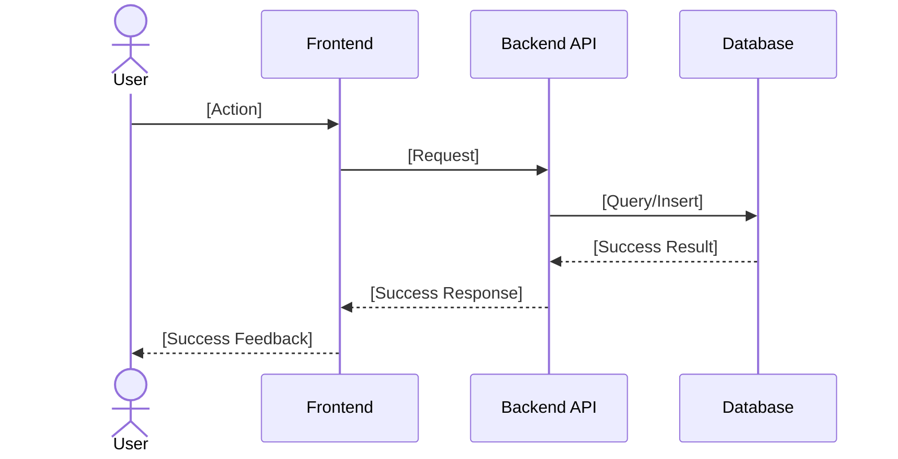
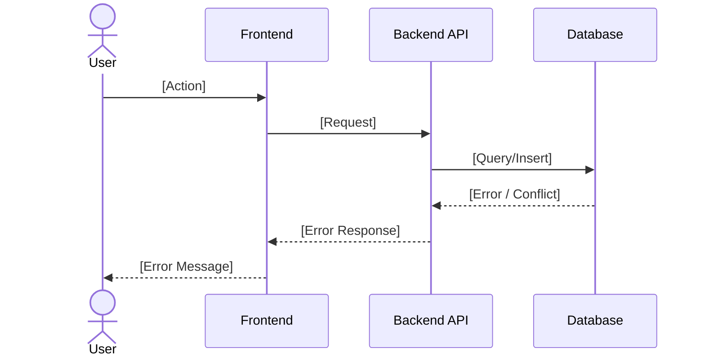
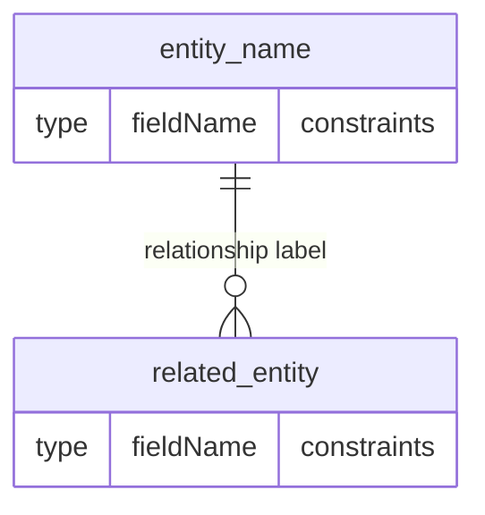

# [Feature Name] — [Brief Description]

- **JIRA**:
  - [TICKET-ID](https://your-jira.atlassian.net/browse/TICKET-ID) — [brief story title]
- **Version**: 1.0
- **Created**: YYYY-MM-DD
- **Last Updated**: YYYY-MM-DD

---

## User Story

> As a [role] at a dealership location, I want to [action],
> so that [benefit].

### Acceptance Criteria

- [ ] Criteria 1
- [ ] Criteria 2
- [ ] Criteria 3

---

## Feature Overview

[2–3 sentence system-level summary of what was built. What module, what it does, how it's scoped.]

### How It Fits In Our System

```
[One-line system flow showing where this feature sits]
User → Frontend (Component) → API (Controller) → DB (Entity) → Related Entity
```

---

## User Journey

### Happy Path



### Failure Path



---

## Data Model

### ERD Diagram

[Scoped Mermaid ERD generated from entities. Include only entities involved in this feature. Follow relationships one level deep. Show business-relevant fields with datatypes. Skip base entity fields (id, createdDate, etc.).]

> **High-level overview only.** This diagram shows key fields and relationships at a glance — it is not a full entity view. See the entity detail tables below for complete column definitions.



### Entity Details

#### [Entity Name] (`collection-name`) <!-- append: _extends IdsBaseEntity_ ONLY if entity extends IdsBaseEntity in code -->

[One sentence describing the purpose of this entity and its role in the feature.]

<!-- Include this blockquote ONLY if the entity extends IdsBaseEntity in code: -->
> Base entity fields are inherited and not listed below.

<table style="border-collapse: collapse; width: 100%;">
  <thead>
    <tr>
      <th style="border: 1px solid #ccc; padding: 8px;">Property</th>
      <th style="border: 1px solid #ccc; padding: 8px;">Type</th>
      <th style="border: 1px solid #ccc; padding: 8px;">Required</th>
      <th style="border: 1px solid #ccc; padding: 8px;">Notes</th>
    </tr>
  </thead>
  <tbody>
    <tr>
      <td style="border: 1px solid #ccc; padding: 8px;">fieldName</td>
      <td style="border: 1px solid #ccc; padding: 8px;">string</td>
      <td style="border: 1px solid #ccc; padding: 8px;">Yes</td>
      <td style="border: 1px solid #ccc; padding: 8px;">Description</td>
    </tr>
  </tbody>
</table>

<!-- Include Unique Index line(s) ONLY if the entity has a database index defined. Skip entirely if none. -->
**Unique Index:** (field1, field2) — [brief reason why this index exists]

<!-- Include Relationships ONLY if the entity references another entity by id or embedded object. Skip entirely if none. -->
**Relationships:**
- [RelationshipType] → [RelatedEntity] ([brief description])

##### Business Rules & Validations — [Entity Name]

[Table of implemented constraints. Focus on business-meaningful rules, not generic TypeScript types.]

<table style="border-collapse: collapse; width: 100%;">
  <thead>
    <tr>
      <th style="border: 1px solid #ccc; padding: 8px;">Entity</th>
      <th style="border: 1px solid #ccc; padding: 8px;">Field</th>
      <th style="border: 1px solid #ccc; padding: 8px;">Rule</th>
      <th style="border: 1px solid #ccc; padding: 8px;">Enforced At</th>
    </tr>
  </thead>
  <tbody>
    <tr>
      <td style="border: 1px solid #ccc; padding: 8px;">[Entity]</td>
      <td style="border: 1px solid #ccc; padding: 8px;">[field]</td>
      <td style="border: 1px solid #ccc; padding: 8px;">[What the rule is]</td>
      <td style="border: 1px solid #ccc; padding: 8px;">[DB constraint / class-validator / service logic]</td>
    </tr>
  </tbody>
</table>

---

#### [Related Entity Name] (`collection-name`) <!-- append: _extends IdsBaseEntity_ ONLY if entity extends IdsBaseEntity in code -->

[One sentence describing the purpose of this entity and its role in the feature.]

<!-- Include this blockquote ONLY if the entity extends IdsBaseEntity in code: -->
> Base entity fields are inherited and not listed below.

<table style="border-collapse: collapse; width: 100%;">
  <thead>
    <tr>
      <th style="border: 1px solid #ccc; padding: 8px;">Property</th>
      <th style="border: 1px solid #ccc; padding: 8px;">Type</th>
      <th style="border: 1px solid #ccc; padding: 8px;">Required</th>
      <th style="border: 1px solid #ccc; padding: 8px;">Notes</th>
    </tr>
  </thead>
  <tbody>
    <tr>
      <td style="border: 1px solid #ccc; padding: 8px;">fieldName</td>
      <td style="border: 1px solid #ccc; padding: 8px;">string</td>
      <td style="border: 1px solid #ccc; padding: 8px;">Yes</td>
      <td style="border: 1px solid #ccc; padding: 8px;">Description</td>
    </tr>
  </tbody>
</table>

<!-- Include Unique Index line(s) ONLY if the entity has a database index defined. Skip entirely if none. -->
**Unique Index:** (field1, field2) — [brief reason why this index exists]

<!-- Include Relationships ONLY if the entity references another entity by id or embedded object. Skip entirely if none. -->
**Relationships:**
- [RelationshipType] → [RelatedEntity] ([brief description])

##### Business Rules & Validations — [Related Entity Name]

[Table of implemented constraints. Focus on business-meaningful rules, not generic TypeScript types.]

<table style="border-collapse: collapse; width: 100%;">
  <thead>
    <tr>
      <th style="border: 1px solid #ccc; padding: 8px;">Entity</th>
      <th style="border: 1px solid #ccc; padding: 8px;">Field</th>
      <th style="border: 1px solid #ccc; padding: 8px;">Rule</th>
      <th style="border: 1px solid #ccc; padding: 8px;">Enforced At</th>
    </tr>
  </thead>
  <tbody>
    <tr>
      <td style="border: 1px solid #ccc; padding: 8px;">[Entity]</td>
      <td style="border: 1px solid #ccc; padding: 8px;">[field]</td>
      <td style="border: 1px solid #ccc; padding: 8px;">[What the rule is]</td>
      <td style="border: 1px solid #ccc; padding: 8px;">[Where enforced]</td>
    </tr>
  </tbody>
</table>

---

## API Endpoints

[Table of endpoints involved in this feature.]

<table style="border-collapse: collapse; width: 100%;">
  <thead>
    <tr>
      <th style="border: 1px solid #ccc; padding: 8px;">Method</th>
      <th style="border: 1px solid #ccc; padding: 8px;">Route</th>
      <th style="border: 1px solid #ccc; padding: 8px;">Description</th>
      <th style="border: 1px solid #ccc; padding: 8px;">Auth</th>
      <th style="border: 1px solid #ccc; padding: 8px;">Request DTO</th>
      <th style="border: 1px solid #ccc; padding: 8px;">Response DTO</th>
    </tr>
  </thead>
  <tbody>
    <tr>
      <td style="border: 1px solid #ccc; padding: 8px;">POST</td>
      <td style="border: 1px solid #ccc; padding: 8px;">/resource</td>
      <td style="border: 1px solid #ccc; padding: 8px;">Create resource</td>
      <td style="border: 1px solid #ccc; padding: 8px;">Yes</td>
      <td style="border: 1px solid #ccc; padding: 8px;">CreateDto</td>
      <td style="border: 1px solid #ccc; padding: 8px;">ResponseDto</td>
    </tr>
    <tr>
      <td style="border: 1px solid #ccc; padding: 8px;">GET</td>
      <td style="border: 1px solid #ccc; padding: 8px;">/resource</td>
      <td style="border: 1px solid #ccc; padding: 8px;">List resources</td>
      <td style="border: 1px solid #ccc; padding: 8px;">Yes</td>
      <td style="border: 1px solid #ccc; padding: 8px;">QueryDto</td>
      <td style="border: 1px solid #ccc; padding: 8px;">PagedResponse</td>
    </tr>
  </tbody>
</table>

---

## Access Control

[Describe authentication and authorization requirements. Who can access these endpoints, what decorator is used (e.g. `@ApiBearerAuth`, `@Auth()`), and how user identity is applied (e.g. audit fields, tenant scoping).]

---

## Configuration

### [Configuration Topic — e.g. DTO Flexibility, Feature Flags]

[Describe any configurable behavior in the feature — e.g. optional fields, usage patterns, environment-driven behavior.]

### Multi-Tenant Data Isolation

[Describe how data is scoped per tenant/location. Which entities are shared globally, which are scoped per location, and what enforces the isolation (e.g. required `locationId` query param, FK constraints).]

- **[Entity]**: [Shared globally / Scoped per location — explain why]
- **[Entity]**: [Shared globally / Scoped per location — explain why]

---

## Implementation Notes

### [Pattern or Decision Name — e.g. Soft Delete, Query Optimization]

[Explain a specific implementation decision, pattern, or behavior that is non-obvious from the code. Include why it was done this way.]

### [Another Pattern — e.g. Primary Vendor Pattern]

[Explanation.]

---

<!-- TEMPLATE RULE: Do NOT add a "Related Documentation" section or link to any other .md files.
     The feature doc must be self-contained. Only include external doc links if the user explicitly requests them. -->
