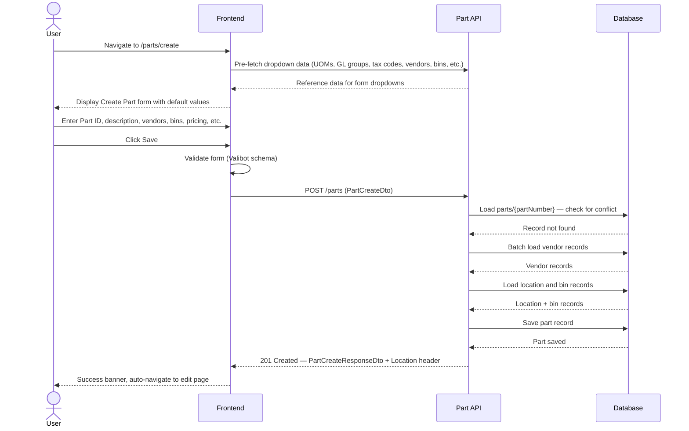
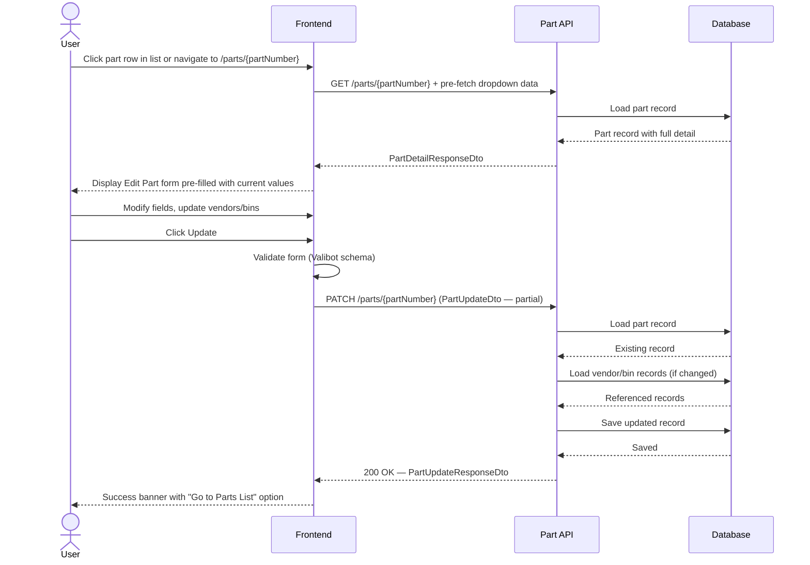
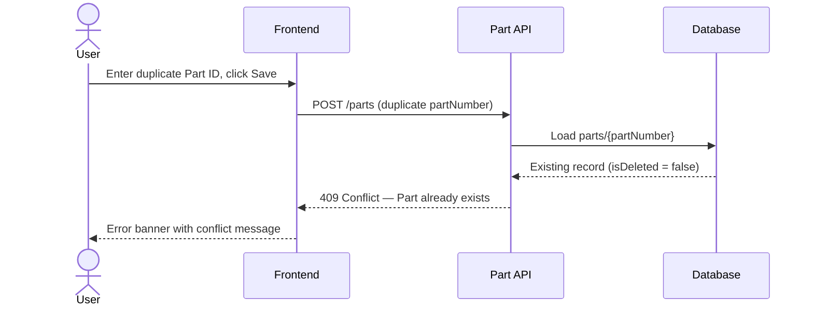
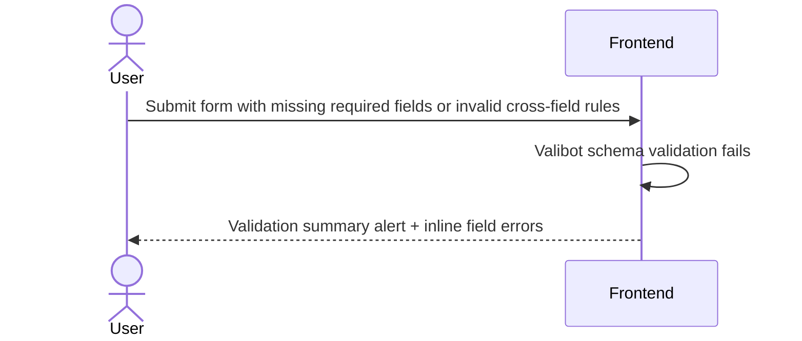
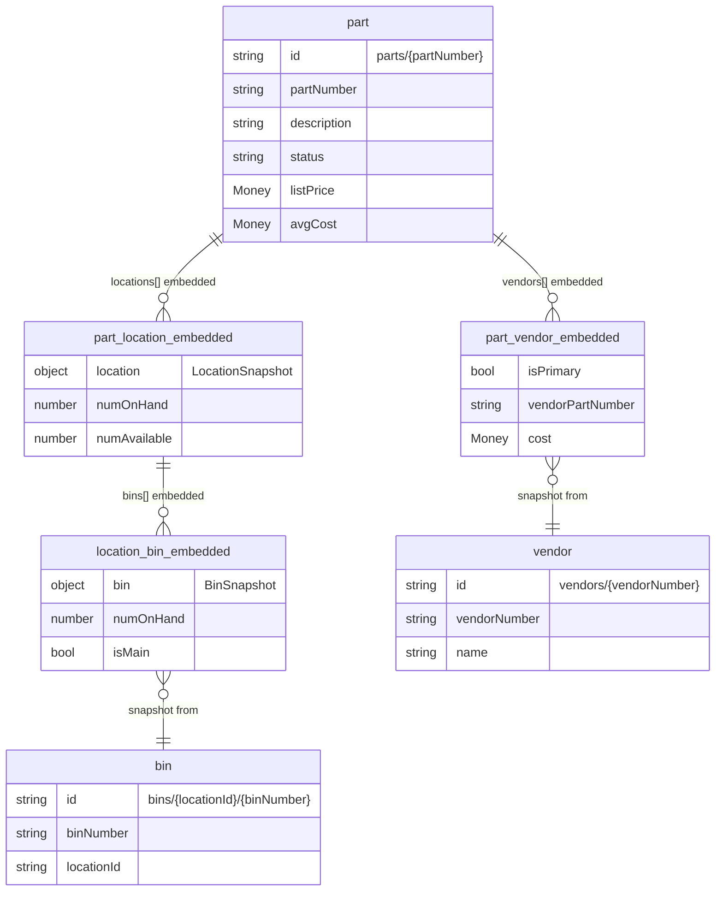

# Part — Create & Edit

- **JIRA**:
  - [IDSMOD-15](https://ids-cloud.atlassian.net/browse/IDSMOD-15) — Provide API to create parts
  - [IDSMOD-59](https://ids-cloud.atlassian.net/browse/IDSMOD-59) — Create a New Part (End-to-End workflow)
- **Version**: 2.0
- **Created**: 2026-02-20
- **Last Updated**: 2026-04-08

---

## User Story

### IDSMOD-15 — Provide API to create parts

> As a developer,
> I want an API to create parts,
> so that test and seed data can be added through the system.

#### Acceptance Criteria

- [x] The API endpoint exists to create a part
- [x] Payload aligns with the Parts entity definition
- [x] Required fields are validated
- [x] Invalid data is rejected
- [x] No direct database writes are required

### IDSMOD-59 — Create a New Part (End-to-End workflow)

> As a dealership parts user,
> I want to create a new part with confidence,
> ensuring data integrity, valid defaults, and duplicate prevention, while keeping the workflow simple and predictable.

#### Acceptance Criteria

- [x] The user launches the Create Part screen with editable Part ID and Description (required)
- [x] Editable part attributes in: Part Maintenance, Availability, Pricing, Unit of Measure, Shipping, Restocking Parameters
- [x] Vendor section is present
- [x] Default values are automatically applied for: Sales UOM, Purchase UOM, Sales/Purchase Ratio, Pricing Group
- [x] The user can enter part details and add vendor information
- [x] The first vendor added is automatically marked as Primary Vendor
- [x] On Save: Part ID uniqueness is validated, Description must exist, at least one vendor is required
- [x] Average Cost is calculated from Primary Vendor on save
- [x] Initial pricing values are initialized on save
- [x] Duplicate Part IDs are blocked at save time
- [x] Part ID supports alphanumeric values

#### System Rules & Constraints

- Part ID supports alphanumeric values (letters, numbers, hyphens, dots, underscores)
- Duplicate Part IDs are blocked at save time (409 Conflict)
- Pricing is initialized but not previewed before save
- Cost calculations occur only on save

#### Explicitly Excluded

- Duplicate Part Number detection while typing
- Pricing preview before save

---

## Feature Overview

The Part Create and Edit feature enables creation and modification of part catalog records with vendor associations, bin assignments, pricing, unit of measure, shipping, and restocking parameters. Parts are stored as records with an ID derived from the part number (`parts/{partNumber}`). Vendors and per-location inventory are embedded directly inside the Part record as nested arrays. The feature includes a full frontend form with sections for identity, availability, pricing, UOM, shipping/restocking, and multi-vendor management — plus an edit mode that loads existing part data and applies three-way partial updates.

### How It Fits In Our System

```
User → Create Part Form → POST /parts → Part Service → Database → Part record (embedded vendors + locations)
User → Edit Part Form → GET /parts/:partNumber → Pre-fill form → PATCH /parts/:partNumber → Part Service → Database
```

---

## User Journey

### Happy Path — Create



### Happy Path — Edit



### Failure Path — Duplicate Part Number (Create)



### Failure Path — Validation Failure (Create or Edit)



---

## Data Model

### ERD Diagram

> **High-level overview only.** This diagram shows key fields and relationships at a glance — it is not a full entity view. See the entity detail tables below for complete column definitions.



### Entity Details

#### Part Entity (`parts` collection) _extends IdsBaseEntity_

The aggregate root for the part catalog. Vendors and location-specific inventory records are embedded directly in the record as arrays. No cross-record lookups are required for standard reads. The record ID is `parts/{partNumber}`.

> Base entity fields are inherited and not listed below.

<table style="border-collapse: collapse; width: 100%;">
  <thead>
    <tr>
      <th style="border: 1px solid #ccc; padding: 8px;">Property</th>
      <th style="border: 1px solid #ccc; padding: 8px;">Type</th>
      <th style="border: 1px solid #ccc; padding: 8px;">Required</th>
      <th style="border: 1px solid #ccc; padding: 8px;">Notes</th>
    </tr>
  </thead>
  <tbody>
    <tr style="background-color: transparent;">
      <td colspan="4" style="border: 1px solid #ccc; padding: 8px;"><strong>Catalog Fields</strong></td>
    </tr>
    <tr>
      <td style="border: 1px solid #ccc; padding: 8px;">partNumber</td>
      <td style="border: 1px solid #ccc; padding: 8px;">string</td>
      <td style="border: 1px solid #ccc; padding: 8px;">Yes</td>
      <td style="border: 1px solid #ccc; padding: 8px;">Also forms the record ID: <code>parts/{partNumber}</code>. Max 50 chars. Alphanumeric + hyphens, dots, underscores.</td>
    </tr>
    <tr>
      <td style="border: 1px solid #ccc; padding: 8px;">description</td>
      <td style="border: 1px solid #ccc; padding: 8px;">string</td>
      <td style="border: 1px solid #ccc; padding: 8px;">Yes</td>
      <td style="border: 1px solid #ccc; padding: 8px;">Human-readable part description</td>
    </tr>
    <tr>
      <td style="border: 1px solid #ccc; padding: 8px;">status</td>
      <td style="border: 1px solid #ccc; padding: 8px;">PartStatus enum</td>
      <td style="border: 1px solid #ccc; padding: 8px;">Yes</td>
      <td style="border: 1px solid #ccc; padding: 8px;">Values: active, inactive, discontinued, retired. Defaults to <code>active</code> on creation.</td>
    </tr>
    <tr>
      <td style="border: 1px solid #ccc; padding: 8px;">vendorPartNumber</td>
      <td style="border: 1px solid #ccc; padding: 8px;">string</td>
      <td style="border: 1px solid #ccc; padding: 8px;">No</td>
      <td style="border: 1px solid #ccc; padding: 8px;">Convenience mirror of the primary vendor's vendorPartNumber for quick display</td>
    </tr>
    <tr>
      <td style="border: 1px solid #ccc; padding: 8px;">unitOfMeasure</td>
      <td style="border: 1px solid #ccc; padding: 8px;">string</td>
      <td style="border: 1px solid #ccc; padding: 8px;">No</td>
      <td style="border: 1px solid #ccc; padding: 8px;">Kept for backwards compatibility</td>
    </tr>
    <tr>
      <td style="border: 1px solid #ccc; padding: 8px;">sellUom</td>
      <td style="border: 1px solid #ccc; padding: 8px;">string</td>
      <td style="border: 1px solid #ccc; padding: 8px;">No</td>
      <td style="border: 1px solid #ccc; padding: 8px;">Sell unit of measure (e.g. EA, SET). Frontend defaults to "EA".</td>
    </tr>
    <tr>
      <td style="border: 1px solid #ccc; padding: 8px;">purchaseUom</td>
      <td style="border: 1px solid #ccc; padding: 8px;">string</td>
      <td style="border: 1px solid #ccc; padding: 8px;">No</td>
      <td style="border: 1px solid #ccc; padding: 8px;">Purchase unit of measure. Frontend defaults to "EA".</td>
    </tr>
    <tr>
      <td style="border: 1px solid #ccc; padding: 8px;">salePurchaseRatio</td>
      <td style="border: 1px solid #ccc; padding: 8px;">number</td>
      <td style="border: 1px solid #ccc; padding: 8px;">No</td>
      <td style="border: 1px solid #ccc; padding: 8px;">How many sell units equal one purchase unit. Frontend defaults to 1.000.</td>
    </tr>
    <tr>
      <td style="border: 1px solid #ccc; padding: 8px;">listPrice</td>
      <td style="border: 1px solid #ccc; padding: 8px;">Money</td>
      <td style="border: 1px solid #ccc; padding: 8px;">No</td>
      <td style="border: 1px solid #ccc; padding: 8px;">Catalog list price as Money object {amount (cents), currency}. Defaults to 0 on create.</td>
    </tr>
    <tr>
      <td style="border: 1px solid #ccc; padding: 8px;">avgCost</td>
      <td style="border: 1px solid #ccc; padding: 8px;">Money</td>
      <td style="border: 1px solid #ccc; padding: 8px;">No</td>
      <td style="border: 1px solid #ccc; padding: 8px;">Average cost. Initialized from primary vendor's cost on creation.</td>
    </tr>
    <tr>
      <td style="border: 1px solid #ccc; padding: 8px;">priceGroup</td>
      <td style="border: 1px solid #ccc; padding: 8px;">string</td>
      <td style="border: 1px solid #ccc; padding: 8px;">No</td>
      <td style="border: 1px solid #ccc; padding: 8px;">Sale category / price group code. Frontend defaults to first available option.</td>
    </tr>
    <tr>
      <td style="border: 1px solid #ccc; padding: 8px;">glGroup</td>
      <td style="border: 1px solid #ccc; padding: 8px;">string</td>
      <td style="border: 1px solid #ccc; padding: 8px;">No</td>
      <td style="border: 1px solid #ccc; padding: 8px;">General ledger group code</td>
    </tr>
    <tr>
      <td style="border: 1px solid #ccc; padding: 8px;">taxCode</td>
      <td style="border: 1px solid #ccc; padding: 8px;">string</td>
      <td style="border: 1px solid #ccc; padding: 8px;">No</td>
      <td style="border: 1px solid #ccc; padding: 8px;">Tax code for taxable parts</td>
    </tr>
    <tr>
      <td style="border: 1px solid #ccc; padding: 8px;">pogNumber</td>
      <td style="border: 1px solid #ccc; padding: 8px;">string</td>
      <td style="border: 1px solid #ccc; padding: 8px;">No</td>
      <td style="border: 1px solid #ccc; padding: 8px;">Planogram number. Max 8 chars, stored uppercase.</td>
    </tr>
    <tr>
      <td style="border: 1px solid #ccc; padding: 8px;">popCode</td>
      <td style="border: 1px solid #ccc; padding: 8px;">string</td>
      <td style="border: 1px solid #ccc; padding: 8px;">No</td>
      <td style="border: 1px solid #ccc; padding: 8px;">Popularity/classification code</td>
    </tr>
    <tr>
      <td style="border: 1px solid #ccc; padding: 8px;">comments</td>
      <td style="border: 1px solid #ccc; padding: 8px;">string</td>
      <td style="border: 1px solid #ccc; padding: 8px;">No</td>
      <td style="border: 1px solid #ccc; padding: 8px;">Internal notes</td>
    </tr>
    <tr>
      <td style="border: 1px solid #ccc; padding: 8px;">shippingWeight</td>
      <td style="border: 1px solid #ccc; padding: 8px;">number</td>
      <td style="border: 1px solid #ccc; padding: 8px;">No</td>
      <td style="border: 1px solid #ccc; padding: 8px;">Shipping weight in pounds</td>
    </tr>
    <tr>
      <td style="border: 1px solid #ccc; padding: 8px;">shippingUnit</td>
      <td style="border: 1px solid #ccc; padding: 8px;">string</td>
      <td style="border: 1px solid #ccc; padding: 8px;">No</td>
      <td style="border: 1px solid #ccc; padding: 8px;">Shipping unit descriptor (e.g. BOX, PALLET). Required when shippingWeight > 0.</td>
    </tr>
    <tr>
      <td style="border: 1px solid #ccc; padding: 8px;">caseQty</td>
      <td style="border: 1px solid #ccc; padding: 8px;">number</td>
      <td style="border: 1px solid #ccc; padding: 8px;">No</td>
      <td style="border: 1px solid #ccc; padding: 8px;">Standard case quantity</td>
    </tr>
    <tr>
      <td style="border: 1px solid #ccc; padding: 8px;">minQty</td>
      <td style="border: 1px solid #ccc; padding: 8px;">number</td>
      <td style="border: 1px solid #ccc; padding: 8px;">No</td>
      <td style="border: 1px solid #ccc; padding: 8px;">Minimum stocking quantity</td>
    </tr>
    <tr>
      <td style="border: 1px solid #ccc; padding: 8px;">maxQty</td>
      <td style="border: 1px solid #ccc; padding: 8px;">number</td>
      <td style="border: 1px solid #ccc; padding: 8px;">No</td>
      <td style="border: 1px solid #ccc; padding: 8px;">Maximum stocking quantity. Must be >= minQty when both are provided.</td>
    </tr>
    <tr>
      <td style="border: 1px solid #ccc; padding: 8px;">minDays</td>
      <td style="border: 1px solid #ccc; padding: 8px;">number</td>
      <td style="border: 1px solid #ccc; padding: 8px;">No</td>
      <td style="border: 1px solid #ccc; padding: 8px;">Minimum days of supply</td>
    </tr>
    <tr>
      <td style="border: 1px solid #ccc; padding: 8px;">minOrder</td>
      <td style="border: 1px solid #ccc; padding: 8px;">number</td>
      <td style="border: 1px solid #ccc; padding: 8px;">No</td>
      <td style="border: 1px solid #ccc; padding: 8px;">Minimum order quantity</td>
    </tr>
    <tr>
      <td style="border: 1px solid #ccc; padding: 8px;">bypassPriceUpdate</td>
      <td style="border: 1px solid #ccc; padding: 8px;">boolean</td>
      <td style="border: 1px solid #ccc; padding: 8px;">No</td>
      <td style="border: 1px solid #ccc; padding: 8px;">When true, price updates from vendor feeds are bypassed</td>
    </tr>
    <tr>
      <td style="border: 1px solid #ccc; padding: 8px;">promptForSerialNumber</td>
      <td style="border: 1px solid #ccc; padding: 8px;">boolean</td>
      <td style="border: 1px solid #ccc; padding: 8px;">No</td>
      <td style="border: 1px solid #ccc; padding: 8px;">When true, system prompts for a serial number on sale</td>
    </tr>
    <tr>
      <td style="border: 1px solid #ccc; padding: 8px;">retireReason</td>
      <td style="border: 1px solid #ccc; padding: 8px;">RetireReason enum</td>
      <td style="border: 1px solid #ccc; padding: 8px;">No</td>
      <td style="border: 1px solid #ccc; padding: 8px;">Values: obsolete, superseded, do-not-sell</td>
    </tr>
    <tr>
      <td style="border: 1px solid #ccc; padding: 8px;">supersededByPartId</td>
      <td style="border: 1px solid #ccc; padding: 8px;">string</td>
      <td style="border: 1px solid #ccc; padding: 8px;">No</td>
      <td style="border: 1px solid #ccc; padding: 8px;">Set when retireReason = superseded; points to replacement Part ID</td>
    </tr>
    <tr>
      <td style="border: 1px solid #ccc; padding: 8px;">alternatePartNumbers</td>
      <td style="border: 1px solid #ccc; padding: 8px;">string[]</td>
      <td style="border: 1px solid #ccc; padding: 8px;">No</td>
      <td style="border: 1px solid #ccc; padding: 8px;">Array of alternate part number strings for cross-reference</td>
    </tr>
    <tr>
      <td style="border: 1px solid #ccc; padding: 8px;">lastReceived</td>
      <td style="border: 1px solid #ccc; padding: 8px;">Date</td>
      <td style="border: 1px solid #ccc; padding: 8px;">No</td>
      <td style="border: 1px solid #ccc; padding: 8px;">Date this part was last received (stamped by PO receiving)</td>
    </tr>
    <tr>
      <td style="border: 1px solid #ccc; padding: 8px;">lastSold</td>
      <td style="border: 1px solid #ccc; padding: 8px;">Date</td>
      <td style="border: 1px solid #ccc; padding: 8px;">No</td>
      <td style="border: 1px solid #ccc; padding: 8px;">Date this part was last sold (stamped by invoice/work order)</td>
    </tr>
    <tr style="background-color: transparent;">
      <td colspan="4" style="border: 1px solid #ccc; padding: 8px;"><strong>Computed Rollup Totals (across all locations)</strong></td>
    </tr>
    <tr>
      <td style="border: 1px solid #ccc; padding: 8px;">totalOnHand</td>
      <td style="border: 1px solid #ccc; padding: 8px;">number</td>
      <td style="border: 1px solid #ccc; padding: 8px;">Yes</td>
      <td style="border: 1px solid #ccc; padding: 8px;">Sum of locations[i].numOnHand. Recomputed on every write.</td>
    </tr>
    <tr>
      <td style="border: 1px solid #ccc; padding: 8px;">totalCommitted</td>
      <td style="border: 1px solid #ccc; padding: 8px;">number</td>
      <td style="border: 1px solid #ccc; padding: 8px;">Yes</td>
      <td style="border: 1px solid #ccc; padding: 8px;">Sum of locations[i].numCommitted</td>
    </tr>
    <tr>
      <td style="border: 1px solid #ccc; padding: 8px;">totalSpecialOrderCommitted</td>
      <td style="border: 1px solid #ccc; padding: 8px;">number</td>
      <td style="border: 1px solid #ccc; padding: 8px;">Yes</td>
      <td style="border: 1px solid #ccc; padding: 8px;">Sum of locations[i].numSpecialOrderCommitted</td>
    </tr>
    <tr>
      <td style="border: 1px solid #ccc; padding: 8px;">totalOnOrder</td>
      <td style="border: 1px solid #ccc; padding: 8px;">number</td>
      <td style="border: 1px solid #ccc; padding: 8px;">Yes</td>
      <td style="border: 1px solid #ccc; padding: 8px;">Sum of locations[i].numOnOrder</td>
    </tr>
    <tr>
      <td style="border: 1px solid #ccc; padding: 8px;">totalBackordered</td>
      <td style="border: 1px solid #ccc; padding: 8px;">number</td>
      <td style="border: 1px solid #ccc; padding: 8px;">Yes</td>
      <td style="border: 1px solid #ccc; padding: 8px;">Sum of locations[i].numBackordered</td>
    </tr>
    <tr>
      <td style="border: 1px solid #ccc; padding: 8px;">totalAvailable</td>
      <td style="border: 1px solid #ccc; padding: 8px;">number</td>
      <td style="border: 1px solid #ccc; padding: 8px;">Yes</td>
      <td style="border: 1px solid #ccc; padding: 8px;">Computed: (totalOnHand + totalOnOrder) - totalCommitted</td>
    </tr>
    <tr>
      <td style="border: 1px solid #ccc; padding: 8px;">totalNetAvailable</td>
      <td style="border: 1px solid #ccc; padding: 8px;">number</td>
      <td style="border: 1px solid #ccc; padding: 8px;">Yes</td>
      <td style="border: 1px solid #ccc; padding: 8px;">Computed: totalAvailable - totalSpecialOrderCommitted</td>
    </tr>
    <tr style="background-color: transparent;">
      <td colspan="4" style="border: 1px solid #ccc; padding: 8px;"><strong>Embedded Arrays</strong></td>
    </tr>
    <tr>
      <td style="border: 1px solid #ccc; padding: 8px;">vendors</td>
      <td style="border: 1px solid #ccc; padding: 8px;">PartVendor[]</td>
      <td style="border: 1px solid #ccc; padding: 8px;">Yes</td>
      <td style="border: 1px solid #ccc; padding: 8px;">Embedded vendor relationships (see PartVendor below)</td>
    </tr>
    <tr>
      <td style="border: 1px solid #ccc; padding: 8px;">locations</td>
      <td style="border: 1px solid #ccc; padding: 8px;">PartLocation[]</td>
      <td style="border: 1px solid #ccc; padding: 8px;">Yes</td>
      <td style="border: 1px solid #ccc; padding: 8px;">Embedded location-inventory records (see PartLocation below)</td>
    </tr>
  </tbody>
</table>

##### Business Rules & Validations — Part

<table style="border-collapse: collapse; width: 100%;">
  <thead>
    <tr>
      <th style="border: 1px solid #ccc; padding: 8px;">Entity</th>
      <th style="border: 1px solid #ccc; padding: 8px;">Field</th>
      <th style="border: 1px solid #ccc; padding: 8px;">Rule</th>
      <th style="border: 1px solid #ccc; padding: 8px;">Enforced At</th>
    </tr>
  </thead>
  <tbody>
    <tr>
      <td style="border: 1px solid #ccc; padding: 8px;">Part</td>
      <td style="border: 1px solid #ccc; padding: 8px;">partNumber</td>
      <td style="border: 1px solid #ccc; padding: 8px;">Required, non-empty, max 50 chars, alphanumeric + hyphens/dots/underscores only</td>
      <td style="border: 1px solid #ccc; padding: 8px;">class-validator (@IsNotEmpty, @MaxLength(50), @Matches regex)</td>
    </tr>
    <tr>
      <td style="border: 1px solid #ccc; padding: 8px;">Part</td>
      <td style="border: 1px solid #ccc; padding: 8px;">partNumber</td>
      <td style="border: 1px solid #ccc; padding: 8px;">Must be globally unique — record ID <code>parts/{partNumber}</code> enforces uniqueness</td>
      <td style="border: 1px solid #ccc; padding: 8px;">Service logic (409 if existing non-deleted record found)</td>
    </tr>
    <tr>
      <td style="border: 1px solid #ccc; padding: 8px;">Part</td>
      <td style="border: 1px solid #ccc; padding: 8px;">description</td>
      <td style="border: 1px solid #ccc; padding: 8px;">Required, must be a non-empty string</td>
      <td style="border: 1px solid #ccc; padding: 8px;">class-validator (@IsNotEmpty, @IsString) + Valibot (frontend)</td>
    </tr>
    <tr>
      <td style="border: 1px solid #ccc; padding: 8px;">Part</td>
      <td style="border: 1px solid #ccc; padding: 8px;">status</td>
      <td style="border: 1px solid #ccc; padding: 8px;">Defaults to <code>PartStatus.Active</code> on creation if not provided</td>
      <td style="border: 1px solid #ccc; padding: 8px;">Service logic</td>
    </tr>
    <tr>
      <td style="border: 1px solid #ccc; padding: 8px;">Part</td>
      <td style="border: 1px solid #ccc; padding: 8px;">minQty / maxQty</td>
      <td style="border: 1px solid #ccc; padding: 8px;">maxQty must be >= minQty when both are provided</td>
      <td style="border: 1px solid #ccc; padding: 8px;">Service cross-field validation + Valibot (frontend)</td>
    </tr>
    <tr>
      <td style="border: 1px solid #ccc; padding: 8px;">Part</td>
      <td style="border: 1px solid #ccc; padding: 8px;">shippingWeight / shippingUnit</td>
      <td style="border: 1px solid #ccc; padding: 8px;">shippingUnit is required when shippingWeight > 0</td>
      <td style="border: 1px solid #ccc; padding: 8px;">Service cross-field validation + Valibot (frontend)</td>
    </tr>
    <tr>
      <td style="border: 1px solid #ccc; padding: 8px;">Part</td>
      <td style="border: 1px solid #ccc; padding: 8px;">pogNumber</td>
      <td style="border: 1px solid #ccc; padding: 8px;">Max 8 characters; stored uppercase (auto-converted)</td>
      <td style="border: 1px solid #ccc; padding: 8px;">class-validator (@MaxLength(8)) + Service logic (toUpperCase)</td>
    </tr>
    <tr>
      <td style="border: 1px solid #ccc; padding: 8px;">Part</td>
      <td style="border: 1px solid #ccc; padding: 8px;">vendors</td>
      <td style="border: 1px solid #ccc; padding: 8px;">At least one vendor required on create</td>
      <td style="border: 1px solid #ccc; padding: 8px;">class-validator (@ArrayMinSize(1)) + Valibot (frontend)</td>
    </tr>
    <tr>
      <td style="border: 1px solid #ccc; padding: 8px;">Part</td>
      <td style="border: 1px solid #ccc; padding: 8px;">vendors</td>
      <td style="border: 1px solid #ccc; padding: 8px;">Exactly one vendor must be marked as primary</td>
      <td style="border: 1px solid #ccc; padding: 8px;">Service logic (BadRequestException)</td>
    </tr>
    <tr>
      <td style="border: 1px solid #ccc; padding: 8px;">Part</td>
      <td style="border: 1px solid #ccc; padding: 8px;">vendors</td>
      <td style="border: 1px solid #ccc; padding: 8px;">Duplicate vendor numbers not allowed</td>
      <td style="border: 1px solid #ccc; padding: 8px;">Service logic (BadRequestException)</td>
    </tr>
    <tr>
      <td style="border: 1px solid #ccc; padding: 8px;">Part</td>
      <td style="border: 1px solid #ccc; padding: 8px;">bins</td>
      <td style="border: 1px solid #ccc; padding: 8px;">Exactly one bin must be marked as main (isMain = true) if bins are provided</td>
      <td style="border: 1px solid #ccc; padding: 8px;">Service logic (BadRequestException)</td>
    </tr>
    <tr>
      <td style="border: 1px solid #ccc; padding: 8px;">Part</td>
      <td style="border: 1px solid #ccc; padding: 8px;">bins</td>
      <td style="border: 1px solid #ccc; padding: 8px;">Duplicate bin codes not allowed</td>
      <td style="border: 1px solid #ccc; padding: 8px;">Service logic (BadRequestException)</td>
    </tr>
  </tbody>
</table>

---

#### PartVendor (embedded in `Part.vendors[]`)

Vendor relationship embedded inside the Part record. Stores a VendorSnapshot so reads require no cross-record lookups. Exactly one entry must have `isPrimary = true` when the array is non-empty.

<table style="border-collapse: collapse; width: 100%;">
  <thead>
    <tr>
      <th style="border: 1px solid #ccc; padding: 8px;">Property</th>
      <th style="border: 1px solid #ccc; padding: 8px;">Type</th>
      <th style="border: 1px solid #ccc; padding: 8px;">Required</th>
      <th style="border: 1px solid #ccc; padding: 8px;">Notes</th>
    </tr>
  </thead>
  <tbody>
    <tr>
      <td style="border: 1px solid #ccc; padding: 8px;">vendor</td>
      <td style="border: 1px solid #ccc; padding: 8px;">VendorSnapshot</td>
      <td style="border: 1px solid #ccc; padding: 8px;">Yes</td>
      <td style="border: 1px solid #ccc; padding: 8px;">Embedded snapshot: {id, vendorNumber, name}</td>
    </tr>
    <tr>
      <td style="border: 1px solid #ccc; padding: 8px;">vendorPartNumber</td>
      <td style="border: 1px solid #ccc; padding: 8px;">string</td>
      <td style="border: 1px solid #ccc; padding: 8px;">No</td>
      <td style="border: 1px solid #ccc; padding: 8px;">Vendor's own identifier for this part. Defaults to the part number if omitted.</td>
    </tr>
    <tr>
      <td style="border: 1px solid #ccc; padding: 8px;">isPrimary</td>
      <td style="border: 1px solid #ccc; padding: 8px;">boolean</td>
      <td style="border: 1px solid #ccc; padding: 8px;">Yes</td>
      <td style="border: 1px solid #ccc; padding: 8px;">Exactly one vendor must be primary. Required field in the DTO.</td>
    </tr>
    <tr>
      <td style="border: 1px solid #ccc; padding: 8px;">cost</td>
      <td style="border: 1px solid #ccc; padding: 8px;">Money</td>
      <td style="border: 1px solid #ccc; padding: 8px;">No</td>
      <td style="border: 1px solid #ccc; padding: 8px;">Cost as Money object {amount (cents), currency: 'USD'}. Defaults to 0 if omitted.</td>
    </tr>
  </tbody>
</table>

##### Business Rules & Validations — PartVendor

<table style="border-collapse: collapse; width: 100%;">
  <thead>
    <tr>
      <th style="border: 1px solid #ccc; padding: 8px;">Entity</th>
      <th style="border: 1px solid #ccc; padding: 8px;">Field</th>
      <th style="border: 1px solid #ccc; padding: 8px;">Rule</th>
      <th style="border: 1px solid #ccc; padding: 8px;">Enforced At</th>
    </tr>
  </thead>
  <tbody>
    <tr>
      <td style="border: 1px solid #ccc; padding: 8px;">PartVendor</td>
      <td style="border: 1px solid #ccc; padding: 8px;">vendorNumber</td>
      <td style="border: 1px solid #ccc; padding: 8px;">Must resolve to existing Vendor record (<code>vendors/{vendorNumber}</code>)</td>
      <td style="border: 1px solid #ccc; padding: 8px;">Service logic (BadRequestException: "The Vendor code is not valid.")</td>
    </tr>
    <tr>
      <td style="border: 1px solid #ccc; padding: 8px;">PartVendor</td>
      <td style="border: 1px solid #ccc; padding: 8px;">cost</td>
      <td style="border: 1px solid #ccc; padding: 8px;">Must be >= 0 if provided</td>
      <td style="border: 1px solid #ccc; padding: 8px;">class-validator (@Min(0), @IsOptional)</td>
    </tr>
    <tr>
      <td style="border: 1px solid #ccc; padding: 8px;">PartVendor</td>
      <td style="border: 1px solid #ccc; padding: 8px;">vendorPartNumber</td>
      <td style="border: 1px solid #ccc; padding: 8px;">Defaults to the part's own partNumber if omitted</td>
      <td style="border: 1px solid #ccc; padding: 8px;">Service logic (<code>vendorDto.vendorPartNumber ?? dto.partNumber</code>)</td>
    </tr>
  </tbody>
</table>

---

#### PartLocation (embedded in `Part.locations[]`)

Location-specific inventory record embedded inside the Part record. Location and bin data are stored as snapshots. Computed fields (`numOnHand`, `numAvailable`) are set on every write.

<table style="border-collapse: collapse; width: 100%;">
  <thead>
    <tr>
      <th style="border: 1px solid #ccc; padding: 8px;">Property</th>
      <th style="border: 1px solid #ccc; padding: 8px;">Type</th>
      <th style="border: 1px solid #ccc; padding: 8px;">Required</th>
      <th style="border: 1px solid #ccc; padding: 8px;">Notes</th>
    </tr>
  </thead>
  <tbody>
    <tr>
      <td style="border: 1px solid #ccc; padding: 8px;">location</td>
      <td style="border: 1px solid #ccc; padding: 8px;">LocationSnapshot</td>
      <td style="border: 1px solid #ccc; padding: 8px;">Yes</td>
      <td style="border: 1px solid #ccc; padding: 8px;">Embedded snapshot: {id, name, displayName?}</td>
    </tr>
    <tr>
      <td style="border: 1px solid #ccc; padding: 8px;">numOnHand</td>
      <td style="border: 1px solid #ccc; padding: 8px;">number</td>
      <td style="border: 1px solid #ccc; padding: 8px;">Yes</td>
      <td style="border: 1px solid #ccc; padding: 8px;">Computed: sum of bins[i].numOnHand. Set from <code>dto.onHandQty</code> on creation.</td>
    </tr>
    <tr>
      <td style="border: 1px solid #ccc; padding: 8px;">numCommitted</td>
      <td style="border: 1px solid #ccc; padding: 8px;">number</td>
      <td style="border: 1px solid #ccc; padding: 8px;">Yes</td>
      <td style="border: 1px solid #ccc; padding: 8px;">Initialized to 0 on creation</td>
    </tr>
    <tr>
      <td style="border: 1px solid #ccc; padding: 8px;">numSpecialOrderCommitted</td>
      <td style="border: 1px solid #ccc; padding: 8px;">number</td>
      <td style="border: 1px solid #ccc; padding: 8px;">Yes</td>
      <td style="border: 1px solid #ccc; padding: 8px;">Initialized to 0 on creation</td>
    </tr>
    <tr>
      <td style="border: 1px solid #ccc; padding: 8px;">numOnOrder</td>
      <td style="border: 1px solid #ccc; padding: 8px;">number</td>
      <td style="border: 1px solid #ccc; padding: 8px;">Yes</td>
      <td style="border: 1px solid #ccc; padding: 8px;">Initialized to 0 on creation</td>
    </tr>
    <tr>
      <td style="border: 1px solid #ccc; padding: 8px;">numBackordered</td>
      <td style="border: 1px solid #ccc; padding: 8px;">number</td>
      <td style="border: 1px solid #ccc; padding: 8px;">Yes</td>
      <td style="border: 1px solid #ccc; padding: 8px;">Initialized to 0 on creation</td>
    </tr>
    <tr>
      <td style="border: 1px solid #ccc; padding: 8px;">numAvailable</td>
      <td style="border: 1px solid #ccc; padding: 8px;">number</td>
      <td style="border: 1px solid #ccc; padding: 8px;">Yes</td>
      <td style="border: 1px solid #ccc; padding: 8px;">Computed: (numOnHand + numOnOrder) - numCommitted</td>
    </tr>
    <tr>
      <td style="border: 1px solid #ccc; padding: 8px;">listPrice</td>
      <td style="border: 1px solid #ccc; padding: 8px;">Money</td>
      <td style="border: 1px solid #ccc; padding: 8px;">No</td>
      <td style="border: 1px solid #ccc; padding: 8px;">Optional location-level list price override; falls back to Part.listPrice</td>
    </tr>
    <tr>
      <td style="border: 1px solid #ccc; padding: 8px;">bins</td>
      <td style="border: 1px solid #ccc; padding: 8px;">LocationBin[]</td>
      <td style="border: 1px solid #ccc; padding: 8px;">Yes</td>
      <td style="border: 1px solid #ccc; padding: 8px;">Per-bin stock allocations. Each entry: {bin: BinSnapshot, numOnHand, isMain}</td>
    </tr>
  </tbody>
</table>

##### Business Rules & Validations — PartLocation

<table style="border-collapse: collapse; width: 100%;">
  <thead>
    <tr>
      <th style="border: 1px solid #ccc; padding: 8px;">Entity</th>
      <th style="border: 1px solid #ccc; padding: 8px;">Field</th>
      <th style="border: 1px solid #ccc; padding: 8px;">Rule</th>
      <th style="border: 1px solid #ccc; padding: 8px;">Enforced At</th>
    </tr>
  </thead>
  <tbody>
    <tr>
      <td style="border: 1px solid #ccc; padding: 8px;">PartLocation</td>
      <td style="border: 1px solid #ccc; padding: 8px;">locationId</td>
      <td style="border: 1px solid #ccc; padding: 8px;">Must resolve to existing Location record</td>
      <td style="border: 1px solid #ccc; padding: 8px;">Service logic (throws NotFoundException)</td>
    </tr>
    <tr>
      <td style="border: 1px solid #ccc; padding: 8px;">PartLocation</td>
      <td style="border: 1px solid #ccc; padding: 8px;">bins[].binCode</td>
      <td style="border: 1px solid #ccc; padding: 8px;">Must resolve to existing Bin record (<code>bins/{locationId}/{binCode}</code>) if provided</td>
      <td style="border: 1px solid #ccc; padding: 8px;">Service logic (BadRequestException)</td>
    </tr>
    <tr>
      <td style="border: 1px solid #ccc; padding: 8px;">PartLocation</td>
      <td style="border: 1px solid #ccc; padding: 8px;">onHandQty</td>
      <td style="border: 1px solid #ccc; padding: 8px;">Defaults to 0 if not provided</td>
      <td style="border: 1px solid #ccc; padding: 8px;">Service logic (<code>dto.onHandQty ?? 0</code>)</td>
    </tr>
  </tbody>
</table>

---

#### Vendor Entity (`vendors` collection) _extends IdsBaseEntity_

Represents vendors/suppliers. Referenced by vendorNumber; a snapshot is embedded in PartVendor at creation time.

> Base entity fields are inherited and not listed below.

<table style="border-collapse: collapse; width: 100%;">
  <thead>
    <tr>
      <th style="border: 1px solid #ccc; padding: 8px;">Property</th>
      <th style="border: 1px solid #ccc; padding: 8px;">Type</th>
      <th style="border: 1px solid #ccc; padding: 8px;">Required</th>
      <th style="border: 1px solid #ccc; padding: 8px;">Notes</th>
    </tr>
  </thead>
  <tbody>
    <tr>
      <td style="border: 1px solid #ccc; padding: 8px;">vendorNumber</td>
      <td style="border: 1px solid #ccc; padding: 8px;">string</td>
      <td style="border: 1px solid #ccc; padding: 8px;">Yes</td>
      <td style="border: 1px solid #ccc; padding: 8px;">Forms the record ID: <code>vendors/{vendorNumber}</code></td>
    </tr>
    <tr>
      <td style="border: 1px solid #ccc; padding: 8px;">name</td>
      <td style="border: 1px solid #ccc; padding: 8px;">string</td>
      <td style="border: 1px solid #ccc; padding: 8px;">Yes</td>
      <td style="border: 1px solid #ccc; padding: 8px;">Vendor company name</td>
    </tr>
  </tbody>
</table>

---

#### Bin Entity (`bins` collection) _extends IdsBaseEntity_

Represents physical storage bins for parts. Scoped to a location. Record ID is `bins/{locationId}/{binNumber}`.

> Base entity fields are inherited and not listed below.

<table style="border-collapse: collapse; width: 100%;">
  <thead>
    <tr>
      <th style="border: 1px solid #ccc; padding: 8px;">Property</th>
      <th style="border: 1px solid #ccc; padding: 8px;">Type</th>
      <th style="border: 1px solid #ccc; padding: 8px;">Required</th>
      <th style="border: 1px solid #ccc; padding: 8px;">Notes</th>
    </tr>
  </thead>
  <tbody>
    <tr>
      <td style="border: 1px solid #ccc; padding: 8px;">binNumber</td>
      <td style="border: 1px solid #ccc; padding: 8px;">string</td>
      <td style="border: 1px solid #ccc; padding: 8px;">Yes</td>
      <td style="border: 1px solid #ccc; padding: 8px;">Bin identifier (e.g. "A-12-3")</td>
    </tr>
    <tr>
      <td style="border: 1px solid #ccc; padding: 8px;">locationId</td>
      <td style="border: 1px solid #ccc; padding: 8px;">string</td>
      <td style="border: 1px solid #ccc; padding: 8px;">Yes</td>
      <td style="border: 1px solid #ccc; padding: 8px;">Location this bin belongs to</td>
    </tr>
    <tr>
      <td style="border: 1px solid #ccc; padding: 8px;">description</td>
      <td style="border: 1px solid #ccc; padding: 8px;">string</td>
      <td style="border: 1px solid #ccc; padding: 8px;">No</td>
      <td style="border: 1px solid #ccc; padding: 8px;">Optional bin description</td>
    </tr>
  </tbody>
</table>

---

## API Endpoints

<table style="border-collapse: collapse; width: 100%;">
  <thead>
    <tr>
      <th style="border: 1px solid #ccc; padding: 8px;">Method</th>
      <th style="border: 1px solid #ccc; padding: 8px;">Route</th>
      <th style="border: 1px solid #ccc; padding: 8px;">Description</th>
      <th style="border: 1px solid #ccc; padding: 8px;">Auth</th>
      <th style="border: 1px solid #ccc; padding: 8px;">Request DTO</th>
      <th style="border: 1px solid #ccc; padding: 8px;">Response DTO</th>
    </tr>
  </thead>
  <tbody>
    <tr>
      <td style="border: 1px solid #ccc; padding: 8px;">POST</td>
      <td style="border: 1px solid #ccc; padding: 8px;">/parts</td>
      <td style="border: 1px solid #ccc; padding: 8px;">Create a new part with vendors, optional inventory, and all catalog fields</td>
      <td style="border: 1px solid #ccc; padding: 8px;">Yes (Bearer + @Auth)</td>
      <td style="border: 1px solid #ccc; padding: 8px;">PartCreateDto</td>
      <td style="border: 1px solid #ccc; padding: 8px;">PartCreateResponseDto</td>
    </tr>
    <tr>
      <td style="border: 1px solid #ccc; padding: 8px;">GET</td>
      <td style="border: 1px solid #ccc; padding: 8px;">/parts/:partNumber</td>
      <td style="border: 1px solid #ccc; padding: 8px;">Retrieve full part detail for the edit form</td>
      <td style="border: 1px solid #ccc; padding: 8px;">Yes (Bearer)</td>
      <td style="border: 1px solid #ccc; padding: 8px;">partNumber (path param)</td>
      <td style="border: 1px solid #ccc; padding: 8px;">PartDetailResponseDto</td>
    </tr>
    <tr>
      <td style="border: 1px solid #ccc; padding: 8px;">PATCH</td>
      <td style="border: 1px solid #ccc; padding: 8px;">/parts/:partNumber</td>
      <td style="border: 1px solid #ccc; padding: 8px;">Partial update of part fields, vendors, and bins</td>
      <td style="border: 1px solid #ccc; padding: 8px;">Yes (Bearer + @Auth)</td>
      <td style="border: 1px solid #ccc; padding: 8px;">PartUpdateDto</td>
      <td style="border: 1px solid #ccc; padding: 8px;">PartUpdateResponseDto</td>
    </tr>
  </tbody>
</table>

### Error Responses

#### POST /parts

| Status | Description | Trigger |
|--------|-------------|---------|
| 400 | Invalid input | DTO validation failure (missing required fields, invalid types, `@Min(0)` on numeric fields, `@MaxLength` exceeded) |
| 400 | Cross-field validation | `maxQty < minQty`, `shippingWeight > 0` without `shippingUnit`, `pogNumber` not uppercase |
| 400 | Vendor business rules | No primary vendor, multiple primary vendors, duplicate vendor numbers, vendor not found in DB |
| 400 | Bin business rules | No main bin, multiple main bins, duplicate bin codes, bin not found in DB |
| 404 | Location not found | `locationId` provided but does not exist in DB |
| 409 | Part already exists | A non-deleted part with the same `partNumber` already exists |

#### GET /parts/:partNumber

| Status | Description | Trigger |
|--------|-------------|---------|
| 404 | Part not found | Part does not exist or is soft-deleted |

#### PATCH /parts/:partNumber

| Status | Description | Trigger |
|--------|-------------|---------|
| 400 | Invalid input | DTO validation failure (invalid types, `@Min(0)` on numeric fields, `@MaxLength` exceeded) |
| 400 | Cross-field validation | `maxQty < minQty`, `shippingWeight > 0` without `shippingUnit`, `pogNumber` not uppercase |
| 400 | Vendor business rules | No primary vendor, multiple primary vendors, duplicate vendor numbers, vendor not found in DB |
| 400 | Bin business rules | No main bin (when bins non-empty), multiple main bins, duplicate bin codes, bin not found in DB |
| 404 | Part not found | Part does not exist or is soft-deleted |

### Request DTO — PartCreateDto (extends PartBaseDto)

<table style="border-collapse: collapse; width: 100%;">
  <thead>
    <tr>
      <th style="border: 1px solid #ccc; padding: 8px;">Field</th>
      <th style="border: 1px solid #ccc; padding: 8px;">Type</th>
      <th style="border: 1px solid #ccc; padding: 8px;">Required</th>
      <th style="border: 1px solid #ccc; padding: 8px;">Validation</th>
      <th style="border: 1px solid #ccc; padding: 8px;">Description</th>
    </tr>
  </thead>
  <tbody>
    <tr style="background-color: transparent;">
      <td colspan="5" style="border: 1px solid #ccc; padding: 8px;"><strong>Catalog Fields (Required)</strong></td>
    </tr>
    <tr>
      <td style="border: 1px solid #ccc; padding: 8px;">partNumber</td>
      <td style="border: 1px solid #ccc; padding: 8px;">string</td>
      <td style="border: 1px solid #ccc; padding: 8px;">Yes</td>
      <td style="border: 1px solid #ccc; padding: 8px;">@IsNotEmpty, @IsString, @MaxLength(50), @Matches(alphanumeric regex)</td>
      <td style="border: 1px solid #ccc; padding: 8px;">Unique part identifier</td>
    </tr>
    <tr>
      <td style="border: 1px solid #ccc; padding: 8px;">description</td>
      <td style="border: 1px solid #ccc; padding: 8px;">string</td>
      <td style="border: 1px solid #ccc; padding: 8px;">Yes</td>
      <td style="border: 1px solid #ccc; padding: 8px;">@IsNotEmpty, @IsString</td>
      <td style="border: 1px solid #ccc; padding: 8px;">Part description</td>
    </tr>
    <tr>
      <td style="border: 1px solid #ccc; padding: 8px;">vendors</td>
      <td style="border: 1px solid #ccc; padding: 8px;">PartVendorCreateDto[]</td>
      <td style="border: 1px solid #ccc; padding: 8px;">Yes</td>
      <td style="border: 1px solid #ccc; padding: 8px;">@IsArray, @ArrayMinSize(1), @ValidateNested</td>
      <td style="border: 1px solid #ccc; padding: 8px;">At least one vendor required; exactly one must have isPrimary: true</td>
    </tr>
    <tr style="background-color: transparent;">
      <td colspan="5" style="border: 1px solid #ccc; padding: 8px;"><strong>Status</strong></td>
    </tr>
    <tr>
      <td style="border: 1px solid #ccc; padding: 8px;">status</td>
      <td style="border: 1px solid #ccc; padding: 8px;">string</td>
      <td style="border: 1px solid #ccc; padding: 8px;">No</td>
      <td style="border: 1px solid #ccc; padding: 8px;">@IsString, @IsOptional</td>
      <td style="border: 1px solid #ccc; padding: 8px;">Defaults to "active" if omitted</td>
    </tr>
    <tr style="background-color: transparent;">
      <td colspan="5" style="border: 1px solid #ccc; padding: 8px;"><strong>Inventory Fields (Optional)</strong></td>
    </tr>
    <tr>
      <td style="border: 1px solid #ccc; padding: 8px;">locationId</td>
      <td style="border: 1px solid #ccc; padding: 8px;">string</td>
      <td style="border: 1px solid #ccc; padding: 8px;">No</td>
      <td style="border: 1px solid #ccc; padding: 8px;">@IsString, @IsOptional</td>
      <td style="border: 1px solid #ccc; padding: 8px;">Location where inventory will be created</td>
    </tr>
    <tr>
      <td style="border: 1px solid #ccc; padding: 8px;">bins</td>
      <td style="border: 1px solid #ccc; padding: 8px;">PartBinCreateDto[]</td>
      <td style="border: 1px solid #ccc; padding: 8px;">No</td>
      <td style="border: 1px solid #ccc; padding: 8px;">@IsArray, @IsOptional, @ValidateNested</td>
      <td style="border: 1px solid #ccc; padding: 8px;">Bins at the given location; exactly one must have isMain: true</td>
    </tr>
    <tr>
      <td style="border: 1px solid #ccc; padding: 8px;">onHandQty</td>
      <td style="border: 1px solid #ccc; padding: 8px;">number</td>
      <td style="border: 1px solid #ccc; padding: 8px;">No</td>
      <td style="border: 1px solid #ccc; padding: 8px;">@IsNumber, @Min(0), @IsOptional</td>
      <td style="border: 1px solid #ccc; padding: 8px;">Initial quantity on hand (defaults to 0)</td>
    </tr>
    <tr style="background-color: transparent;">
      <td colspan="5" style="border: 1px solid #ccc; padding: 8px;"><strong>Pricing / UOM / Shipping / Restocking / Accounting / Controls</strong></td>
    </tr>
    <tr>
      <td style="border: 1px solid #ccc; padding: 8px;">listPrice</td>
      <td style="border: 1px solid #ccc; padding: 8px;">number</td>
      <td style="border: 1px solid #ccc; padding: 8px;">No</td>
      <td style="border: 1px solid #ccc; padding: 8px;">@IsNumber, @Min(0)</td>
      <td style="border: 1px solid #ccc; padding: 8px;">List price in cents</td>
    </tr>
    <tr>
      <td style="border: 1px solid #ccc; padding: 8px;">sellUom, purchaseUom</td>
      <td style="border: 1px solid #ccc; padding: 8px;">string</td>
      <td style="border: 1px solid #ccc; padding: 8px;">No</td>
      <td style="border: 1px solid #ccc; padding: 8px;">@IsString, @IsOptional</td>
      <td style="border: 1px solid #ccc; padding: 8px;">Unit of measure codes</td>
    </tr>
    <tr>
      <td style="border: 1px solid #ccc; padding: 8px;">salePurchaseRatio</td>
      <td style="border: 1px solid #ccc; padding: 8px;">number</td>
      <td style="border: 1px solid #ccc; padding: 8px;">No</td>
      <td style="border: 1px solid #ccc; padding: 8px;">@IsNumber, @Min(0)</td>
      <td style="border: 1px solid #ccc; padding: 8px;">Sale-to-purchase ratio</td>
    </tr>
    <tr>
      <td style="border: 1px solid #ccc; padding: 8px;">shippingWeight, caseQty, minQty, maxQty, minDays, minOrder</td>
      <td style="border: 1px solid #ccc; padding: 8px;">number</td>
      <td style="border: 1px solid #ccc; padding: 8px;">No</td>
      <td style="border: 1px solid #ccc; padding: 8px;">@IsNumber, @Min(0), @IsOptional</td>
      <td style="border: 1px solid #ccc; padding: 8px;">Shipping/restocking parameters</td>
    </tr>
    <tr>
      <td style="border: 1px solid #ccc; padding: 8px;">shippingUnit, priceGroup, glGroup, taxCode, pogNumber, popCode, comments</td>
      <td style="border: 1px solid #ccc; padding: 8px;">string</td>
      <td style="border: 1px solid #ccc; padding: 8px;">No</td>
      <td style="border: 1px solid #ccc; padding: 8px;">@IsString, @IsOptional (pogNumber: @MaxLength(8))</td>
      <td style="border: 1px solid #ccc; padding: 8px;">Accounting and descriptive fields</td>
    </tr>
    <tr>
      <td style="border: 1px solid #ccc; padding: 8px;">serialized, bypassPriceUpdate</td>
      <td style="border: 1px solid #ccc; padding: 8px;">boolean</td>
      <td style="border: 1px solid #ccc; padding: 8px;">No</td>
      <td style="border: 1px solid #ccc; padding: 8px;">@IsBoolean, @IsOptional</td>
      <td style="border: 1px solid #ccc; padding: 8px;">Control flags. <code>serialized</code> maps to <code>promptForSerialNumber</code> on entity.</td>
    </tr>
    <tr>
      <td style="border: 1px solid #ccc; padding: 8px;">alternatePartNumbers</td>
      <td style="border: 1px solid #ccc; padding: 8px;">string[]</td>
      <td style="border: 1px solid #ccc; padding: 8px;">No</td>
      <td style="border: 1px solid #ccc; padding: 8px;">@IsArray, @IsString({each: true})</td>
      <td style="border: 1px solid #ccc; padding: 8px;">Cross-reference part numbers</td>
    </tr>
  </tbody>
</table>

### Request DTO — PartUpdateDto

All fields are optional (partial update). Part number cannot be changed (comes from URL path). Vendors and bins use full-replace semantics when provided. Same field set as PartCreateDto minus `partNumber`, `locationId`, and `onHandQty`. Reuses `PartVendorCreateDto` and `PartBinCreateDto` types.

### Response DTO — PartCreateResponseDto (extends PartBaseResponseDto)

<table style="border-collapse: collapse; width: 100%;">
  <thead>
    <tr>
      <th style="border: 1px solid #ccc; padding: 8px;">Field</th>
      <th style="border: 1px solid #ccc; padding: 8px;">Type</th>
      <th style="border: 1px solid #ccc; padding: 8px;">Notes</th>
    </tr>
  </thead>
  <tbody>
    <tr>
      <td style="border: 1px solid #ccc; padding: 8px;">partNumber</td>
      <td style="border: 1px solid #ccc; padding: 8px;">string</td>
      <td style="border: 1px solid #ccc; padding: 8px;">The created part's number</td>
    </tr>
    <tr>
      <td style="border: 1px solid #ccc; padding: 8px;">description</td>
      <td style="border: 1px solid #ccc; padding: 8px;">string</td>
      <td style="border: 1px solid #ccc; padding: 8px;">Part description</td>
    </tr>
    <tr>
      <td style="border: 1px solid #ccc; padding: 8px;">locationId</td>
      <td style="border: 1px solid #ccc; padding: 8px;">string | null</td>
      <td style="border: 1px solid #ccc; padding: 8px;">Echoes the locationId from the request, or null if no location was provided</td>
    </tr>
  </tbody>
</table>

The response also sets a `Location` response header pointing to `/api/parts/{partNumber}`.

### Response DTO — PartUpdateResponseDto (extends PartBaseResponseDto)

<table style="border-collapse: collapse; width: 100%;">
  <thead>
    <tr>
      <th style="border: 1px solid #ccc; padding: 8px;">Field</th>
      <th style="border: 1px solid #ccc; padding: 8px;">Type</th>
      <th style="border: 1px solid #ccc; padding: 8px;">Notes</th>
    </tr>
  </thead>
  <tbody>
    <tr>
      <td style="border: 1px solid #ccc; padding: 8px;">partNumber</td>
      <td style="border: 1px solid #ccc; padding: 8px;">string</td>
      <td style="border: 1px solid #ccc; padding: 8px;">The updated part's number</td>
    </tr>
    <tr>
      <td style="border: 1px solid #ccc; padding: 8px;">description</td>
      <td style="border: 1px solid #ccc; padding: 8px;">string</td>
      <td style="border: 1px solid #ccc; padding: 8px;">Part description (current value after update)</td>
    </tr>
  </tbody>
</table>

### Response DTO — PartDetailResponseDto (extends PartWithInventoryResponseDto)

Returns all list-level fields plus every editable field, vendor array, and bin array. Used by `GET /parts/:partNumber` to populate the edit form. See the `part-list.md` doc for `PartWithInventoryResponseDto` base fields.

Additional fields beyond the list response: `purchaseUom`, `salePurchaseRatio`, `comments`, `shippingWeight`, `shippingUnit`, `caseQty`, `minQty`, `maxQty`, `minDays`, `minOrder`, `bypassPriceUpdate`, `promptForSerialNumber`, `avgCost`, `priceGroup`, `glGroup`, `taxCode`, `pogNumber`, `popCode`, `alternatePartNumbers`, `lastReceived`, `lastSold`, `bins[]` (PartDetailBinDto), `vendors[]` (PartDetailVendorDto).

---

## Access Control

The create and update endpoints require authentication via bearer token (`@ApiBearerAuth()` on the controller) and use the `@Auth()` decorator to extract the user's `sub` (subject/user ID) from the JWT. The detail endpoint (`GET /parts/:partNumber`) requires bearer auth but does not use `@Auth()`.

**Audit fields**: The `sub` value is stored as `createdBy` and `updatedBy` via `createIdsBaseEntity(userId)` on create and `touchIdsBaseEntity(part, userId)` on update.

**Authorization**: No role-based authorization is currently enforced — any authenticated user can create, read, and update parts.

---

## Configuration

### Frontend Form Defaults

When the create form loads, the following defaults are applied automatically by the `buildDefaultValues` mapper:

- **Status**: "active" (first matching status code option)
- **Sell UOM**: "EA" (looked up from UOM reference data)
- **Purchase UOM**: "EA" (looked up from UOM reference data)
- **Sale/Purchase Ratio**: 1.000
- **Price Group**: First available sale category option
- **Shipping Unit**: First available ship weight code option
- **bypassPriceUpdate**: false
- **promptForSerialNumber**: false

### Frontend Form Sections

The form is composed of five reusable section components:

1. **PartIdentitySection** — Part ID (read-only in edit mode), description, status, alternate part number (searchable picker), bins (multi-bin picker with main designation)
2. **AvailabilitySection** — Read-only inventory quantities (on-hand, committed, on-order, available, backordered) in create vs edit mode
3. **PricingSection** — List price, sale category/price group (with GL group auto-link), GL group, tax code
4. **UnitOfMeasureSection** — Sell UOM, purchase UOM, sale/purchase ratio
5. **ShippingRestockingSection** — Shipping weight/unit, case qty, min/max qty, min days, min order, POG number, POP code, bypass price update checkbox, serialized checkbox, comments
6. **VendorSection** — Multi-vendor table with add/remove, primary vendor toggle, vendor search picker, vendor part number, cost per vendor

### Frontend Validation (Valibot)

The form uses Valibot schemas (`partCreateSchema` and `partUpdateSchema`) that mirror backend validation. Cross-field rules enforced on the frontend:

- shippingUnit required when shippingWeight is entered
- maxQty >= minQty when both are provided
- At least one vendor required

### Multi-Tenant Data Isolation

- **Part**: Scoped globally — the part number is the record ID (`parts/{partNumber}`) and is unique across all locations.
- **PartVendor (embedded)**: Vendor relationships are global — the VendorSnapshot is embedded in the Part record without location scoping.
- **PartLocation (embedded)**: Inventory is location-scoped — each entry in `Part.locations[]` contains a `LocationSnapshot` with the location's ID and name.
- **Vendor**: Global — vendor record IDs are `vendors/{vendorNumber}`.
- **Bin**: Scoped per location — bin record IDs are `bins/{locationId}/{binNumber}`.

**Key implication**: A Part record is a single global record. Location-specific inventory lives inside that record's `locations[]` array. Multiple locations can each have their own embedded PartLocation within the same Part record.

---

## Implementation Notes

### Embedded Aggregate Model

Vendors and per-location inventory records are embedded as owned children inside the Part record. No separate collections are written for these — cross-record lookups are eliminated for standard reads.

### Conflict Detection via Record ID

Uniqueness is enforced by using the part number as the record ID (`parts/{partNumber}`). The service loads `parts/{partNumber}` before writing; if the record exists and `isDeleted = false`, a 409 is thrown.

### Single Atomic Write (Create)

The create operation performs all reads (vendor batch load, location load, bin batch load) before issuing a single write. The Part record is written atomically. There is no multi-record transaction.

### Batch Loading for N+1 Prevention

Vendor and bin lookups use batch loading (`session.load<Vendor>(vendorIds)` with an array of IDs) to avoid N+1 round trips. This handles multi-vendor and multi-bin payloads efficiently in a single database call per entity type.

### Average Cost Initialization

On creation, the `avgCost` field is initialized from the primary vendor's cost. If the primary vendor has no cost, `avgCost` defaults to `{amount: 0, currency: 'USD'}`.

### Three-Way Partial Update (Edit)

The update service uses three-way field semantics for optional fields:
- `undefined` (key absent from JSON payload) — field is not touched
- `null` (explicitly sent) — field is cleared (stored as null/undefined)
- `value` — field is updated

This allows the frontend to distinguish between "don't change this field" and "clear this field". The `transformToApiPayload` mapper in the frontend sends `null` for cleared optional fields in edit mode, and omits them entirely in create mode.

### Vendor and Bin Full-Replace Semantics (Edit)

When `dto.vendors` or `dto.bins` is provided in the update payload, the entire array is replaced — not merged. The service rebuilds vendor snapshots from fresh database lookups and carries forward existing bin `numOnHand` values by matching on `binNumber`.

### Cost Stored as Money Object

The `cost` field in the DTO is a plain number (cents). The service converts it to a `Money` object (`toMoney(dto.cost, 'USD')`) when building the embedded PartVendor snapshot.

### Frontend Create-to-Edit Navigation

After a successful create, the frontend shows a success banner via `HideAfterDelay` and auto-navigates to the edit page (`/parts/{partNumber}`) using `navigate(..., {replace: true})`.

### Unsaved Changes Guards

Both create and edit pages implement unsaved changes protection. The `useUnsavedChangesGuard` hook blocks browser back/forward navigation when the form is dirty. The `useLocationChangePrompt` hook intercepts location switch attempts and redirects to `/parts` after confirmation.

### Frontend Pre-fetch Strategy

Both create and edit pages pre-fetch all dropdown reference data in the `clientLoader` using `queryClient.ensureQueryData`. This includes: part status codes, UOMs, GL groups, tax codes, sale categories, ship weight codes, initial vendors (top 10), and initial bins (top 10 for the current location). The edit page additionally pre-fetches the part detail record.

### Seed Data

Seed data files exist at:
- `database/seeds/data/part.data.ts` — Part catalog definitions
- `database/seeds/data/part-location.data.ts` — Location inventory seed entries
- `database/seeds/data/part-vendor.data.ts` — Vendor relationship seed entries
- `database/seeds/data/part-status-code.data.ts` — Part status code reference data

### Automated Tests

Unit tests exist at:
- `apps/astra-apis/src/part/__test__/part.service.test.ts`
- `apps/astra-apis/src/part/__test__/part.controller.test.ts`
