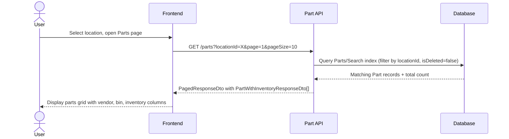
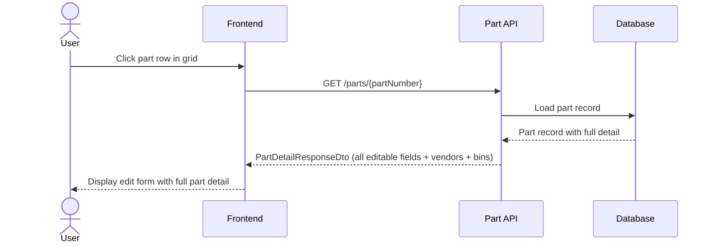
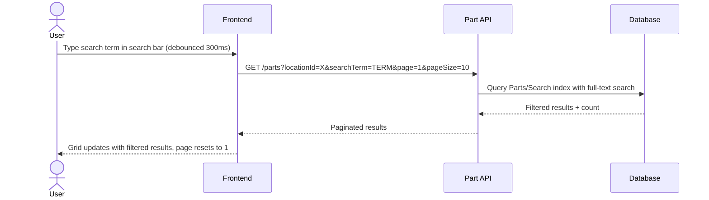
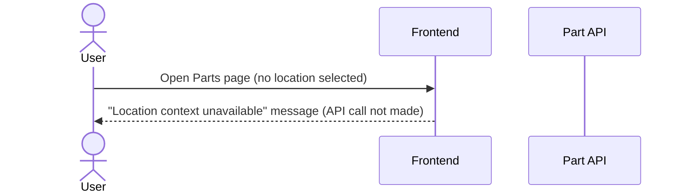
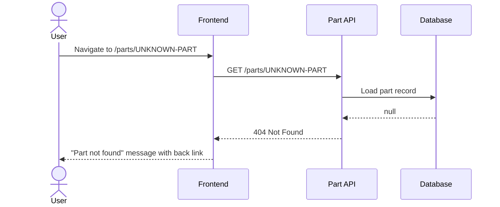
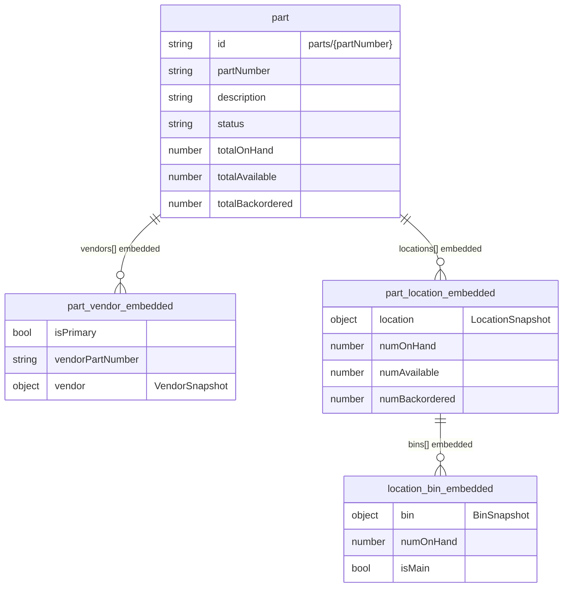

# Part — List & Detail

- **JIRA**:
  - [IDSMOD-14](https://ids-cloud.atlassian.net/browse/IDSMOD-14) — Define minimal Parts entity
- **Version**: 2.0
- **Created**: 2026-02-20
- **Last Updated**: 2026-04-08

---

## User Story

### IDSMOD-14 — Define minimal Parts entity

> As a developer,
> I want a minimal Parts entity defined,
> so that the system can support listing parts without unnecessary complexity.

This story establishes the foundational data model required to support listing parts in the system.

#### Acceptance Criteria

- [x] Only the fields required for listing parts are included
- [x] Legacy or unused fields are excluded
- [x] Required and optional fields are clearly defined
- [x] Naming conventions follow agreed standards
- [x] The entity supports future extension without refactoring

#### Part Fields Required for Listing

- Part Number
- Description
- Main Vendor (Vendor Name)
- Vendor Part Number
- On Hand Qty (total across all locations + location-specific)
- List Price
- Sell UOM
- Main Bin

---

## Feature Overview

The Part List & Detail feature provides paginated retrieval and single-record detail for parts, including their embedded inventory, bin, and vendor information scoped to a specific location. The Part is an aggregate record; inventory quantities and vendor relationships are embedded inside each Part record — no joins are required. The list is powered by a server-side full-text search index (`Parts/Search`) that supports filtering by location and free-text search across part number, description, vendor names, bin numbers, and more. The list page serves as the primary navigation hub for parts — it includes a search bar and a "Create Part" button that navigates to the create form.

### How It Fits In Our System

```
User → Frontend → GET /parts?locationId=X → Part API → Database (Parts/Search index) → Paginated Results
User → Frontend → GET /parts/:partNumber  → Part API → Database (record lookup)      → Detail Response
User → Frontend → Click "Create Part"     → Navigate to /parts/create
User → Frontend → Click part row          → Navigate to /parts/{partNumber} (edit page)
```

---

## User Journey

### Happy Path — List



### Happy Path — Detail (Edit Page)



### Happy Path — Search



### Failure Path — Missing Location



### Failure Path — Part Not Found (Detail)



---

## Data Model

### ERD Diagram

> **High-level overview only.** This diagram shows key fields and relationships at a glance — it is not a full entity view. See the entity detail tables below for complete column definitions.



### Entity Details

#### Part Entity (`parts` collection) _extends IdsBaseEntity_

The aggregate root for the part catalog. All vendor and inventory data is embedded directly in the record. The `Parts/Search` index is used for list queries; direct record lookup is used for detail queries.

> Base entity fields are inherited and not listed below.

<table style="border-collapse: collapse; width: 100%;">
  <thead>
    <tr>
      <th style="border: 1px solid #ccc; padding: 8px;">Property</th>
      <th style="border: 1px solid #ccc; padding: 8px;">Type</th>
      <th style="border: 1px solid #ccc; padding: 8px;">Required</th>
      <th style="border: 1px solid #ccc; padding: 8px;">Notes</th>
    </tr>
  </thead>
  <tbody>
    <tr style="background-color: transparent;">
      <td colspan="4" style="border: 1px solid #ccc; padding: 8px;"><strong>Catalog Fields</strong></td>
    </tr>
    <tr>
      <td style="border: 1px solid #ccc; padding: 8px;">partNumber</td>
      <td style="border: 1px solid #ccc; padding: 8px;">string</td>
      <td style="border: 1px solid #ccc; padding: 8px;">Yes</td>
      <td style="border: 1px solid #ccc; padding: 8px;">Forms record ID: <code>parts/{partNumber}</code>. Globally unique. Max 50 chars, alphanumeric + hyphens/dots/underscores.</td>
    </tr>
    <tr>
      <td style="border: 1px solid #ccc; padding: 8px;">description</td>
      <td style="border: 1px solid #ccc; padding: 8px;">string</td>
      <td style="border: 1px solid #ccc; padding: 8px;">Yes</td>
      <td style="border: 1px solid #ccc; padding: 8px;">Part description</td>
    </tr>
    <tr>
      <td style="border: 1px solid #ccc; padding: 8px;">status</td>
      <td style="border: 1px solid #ccc; padding: 8px;">PartStatus enum</td>
      <td style="border: 1px solid #ccc; padding: 8px;">Yes</td>
      <td style="border: 1px solid #ccc; padding: 8px;">Values: active, inactive, discontinued, retired</td>
    </tr>
    <tr>
      <td style="border: 1px solid #ccc; padding: 8px;">vendorPartNumber</td>
      <td style="border: 1px solid #ccc; padding: 8px;">string</td>
      <td style="border: 1px solid #ccc; padding: 8px;">No</td>
      <td style="border: 1px solid #ccc; padding: 8px;">Convenience mirror of the primary vendor's vendorPartNumber</td>
    </tr>
    <tr>
      <td style="border: 1px solid #ccc; padding: 8px;">sellUom</td>
      <td style="border: 1px solid #ccc; padding: 8px;">string</td>
      <td style="border: 1px solid #ccc; padding: 8px;">No</td>
      <td style="border: 1px solid #ccc; padding: 8px;">Sell unit of measure (e.g. EA, SET)</td>
    </tr>
    <tr>
      <td style="border: 1px solid #ccc; padding: 8px;">listPrice</td>
      <td style="border: 1px solid #ccc; padding: 8px;">Money</td>
      <td style="border: 1px solid #ccc; padding: 8px;">No</td>
      <td style="border: 1px solid #ccc; padding: 8px;">Catalog list price as Money {amount (cents), currency}</td>
    </tr>
    <tr>
      <td style="border: 1px solid #ccc; padding: 8px;">avgCost</td>
      <td style="border: 1px solid #ccc; padding: 8px;">Money</td>
      <td style="border: 1px solid #ccc; padding: 8px;">No</td>
      <td style="border: 1px solid #ccc; padding: 8px;">Average cost (weighted moving average)</td>
    </tr>
    <tr>
      <td style="border: 1px solid #ccc; padding: 8px;">alternatePartNumbers</td>
      <td style="border: 1px solid #ccc; padding: 8px;">string[]</td>
      <td style="border: 1px solid #ccc; padding: 8px;">No</td>
      <td style="border: 1px solid #ccc; padding: 8px;">Array of alternate part number strings</td>
    </tr>
    <tr style="background-color: transparent;">
      <td colspan="4" style="border: 1px solid #ccc; padding: 8px;"><strong>Computed Rollup Totals (across all locations)</strong></td>
    </tr>
    <tr>
      <td style="border: 1px solid #ccc; padding: 8px;">totalOnHand</td>
      <td style="border: 1px solid #ccc; padding: 8px;">number</td>
      <td style="border: 1px solid #ccc; padding: 8px;">Yes</td>
      <td style="border: 1px solid #ccc; padding: 8px;">Sum of all locations[i].numOnHand. Recomputed on every write.</td>
    </tr>
    <tr>
      <td style="border: 1px solid #ccc; padding: 8px;">totalCommitted</td>
      <td style="border: 1px solid #ccc; padding: 8px;">number</td>
      <td style="border: 1px solid #ccc; padding: 8px;">Yes</td>
      <td style="border: 1px solid #ccc; padding: 8px;">Sum of all locations[i].numCommitted</td>
    </tr>
    <tr>
      <td style="border: 1px solid #ccc; padding: 8px;">totalSpecialOrderCommitted</td>
      <td style="border: 1px solid #ccc; padding: 8px;">number</td>
      <td style="border: 1px solid #ccc; padding: 8px;">Yes</td>
      <td style="border: 1px solid #ccc; padding: 8px;">Sum of all locations[i].numSpecialOrderCommitted</td>
    </tr>
    <tr>
      <td style="border: 1px solid #ccc; padding: 8px;">totalOnOrder</td>
      <td style="border: 1px solid #ccc; padding: 8px;">number</td>
      <td style="border: 1px solid #ccc; padding: 8px;">Yes</td>
      <td style="border: 1px solid #ccc; padding: 8px;">Sum of all locations[i].numOnOrder</td>
    </tr>
    <tr>
      <td style="border: 1px solid #ccc; padding: 8px;">totalBackordered</td>
      <td style="border: 1px solid #ccc; padding: 8px;">number</td>
      <td style="border: 1px solid #ccc; padding: 8px;">Yes</td>
      <td style="border: 1px solid #ccc; padding: 8px;">Sum of all locations[i].numBackordered</td>
    </tr>
    <tr>
      <td style="border: 1px solid #ccc; padding: 8px;">totalAvailable</td>
      <td style="border: 1px solid #ccc; padding: 8px;">number</td>
      <td style="border: 1px solid #ccc; padding: 8px;">Yes</td>
      <td style="border: 1px solid #ccc; padding: 8px;">Computed: (totalOnHand + totalOnOrder) - totalCommitted</td>
    </tr>
    <tr>
      <td style="border: 1px solid #ccc; padding: 8px;">totalNetAvailable</td>
      <td style="border: 1px solid #ccc; padding: 8px;">number</td>
      <td style="border: 1px solid #ccc; padding: 8px;">Yes</td>
      <td style="border: 1px solid #ccc; padding: 8px;">Computed: totalAvailable - totalSpecialOrderCommitted</td>
    </tr>
    <tr style="background-color: transparent;">
      <td colspan="4" style="border: 1px solid #ccc; padding: 8px;"><strong>Embedded Arrays</strong></td>
    </tr>
    <tr>
      <td style="border: 1px solid #ccc; padding: 8px;">vendors</td>
      <td style="border: 1px solid #ccc; padding: 8px;">PartVendor[]</td>
      <td style="border: 1px solid #ccc; padding: 8px;">Yes</td>
      <td style="border: 1px solid #ccc; padding: 8px;">Embedded vendor relationships with VendorSnapshot</td>
    </tr>
    <tr>
      <td style="border: 1px solid #ccc; padding: 8px;">locations</td>
      <td style="border: 1px solid #ccc; padding: 8px;">PartLocation[]</td>
      <td style="border: 1px solid #ccc; padding: 8px;">Yes</td>
      <td style="border: 1px solid #ccc; padding: 8px;">Embedded per-location inventory records with bins</td>
    </tr>
  </tbody>
</table>

##### Business Rules & Validations — Part

<table style="border-collapse: collapse; width: 100%;">
  <thead>
    <tr>
      <th style="border: 1px solid #ccc; padding: 8px;">Entity</th>
      <th style="border: 1px solid #ccc; padding: 8px;">Field</th>
      <th style="border: 1px solid #ccc; padding: 8px;">Rule</th>
      <th style="border: 1px solid #ccc; padding: 8px;">Enforced At</th>
    </tr>
  </thead>
  <tbody>
    <tr>
      <td style="border: 1px solid #ccc; padding: 8px;">Part</td>
      <td style="border: 1px solid #ccc; padding: 8px;">partNumber</td>
      <td style="border: 1px solid #ccc; padding: 8px;">Globally unique — enforced by record ID convention</td>
      <td style="border: 1px solid #ccc; padding: 8px;">Service logic (409 check before write)</td>
    </tr>
    <tr>
      <td style="border: 1px solid #ccc; padding: 8px;">Part</td>
      <td style="border: 1px solid #ccc; padding: 8px;">isDeleted</td>
      <td style="border: 1px solid #ccc; padding: 8px;">Soft-deleted parts are excluded from list results and detail lookups</td>
      <td style="border: 1px solid #ccc; padding: 8px;">Index filter + service logic (404 if <code>part.isDeleted</code>)</td>
    </tr>
  </tbody>
</table>

---

#### PartVendor (embedded in `Part.vendors[]`)

Vendor relationship embedded inside the Part record. Stores a VendorSnapshot for zero-lookup reads.

<table style="border-collapse: collapse; width: 100%;">
  <thead>
    <tr>
      <th style="border: 1px solid #ccc; padding: 8px;">Property</th>
      <th style="border: 1px solid #ccc; padding: 8px;">Type</th>
      <th style="border: 1px solid #ccc; padding: 8px;">Required</th>
      <th style="border: 1px solid #ccc; padding: 8px;">Notes</th>
    </tr>
  </thead>
  <tbody>
    <tr>
      <td style="border: 1px solid #ccc; padding: 8px;">vendor</td>
      <td style="border: 1px solid #ccc; padding: 8px;">VendorSnapshot</td>
      <td style="border: 1px solid #ccc; padding: 8px;">Yes</td>
      <td style="border: 1px solid #ccc; padding: 8px;">Snapshot: {id, vendorNumber, name}</td>
    </tr>
    <tr>
      <td style="border: 1px solid #ccc; padding: 8px;">vendorPartNumber</td>
      <td style="border: 1px solid #ccc; padding: 8px;">string</td>
      <td style="border: 1px solid #ccc; padding: 8px;">No</td>
      <td style="border: 1px solid #ccc; padding: 8px;">Vendor's part number for this item</td>
    </tr>
    <tr>
      <td style="border: 1px solid #ccc; padding: 8px;">isPrimary</td>
      <td style="border: 1px solid #ccc; padding: 8px;">boolean</td>
      <td style="border: 1px solid #ccc; padding: 8px;">Yes</td>
      <td style="border: 1px solid #ccc; padding: 8px;">Exactly one entry should be true when vendors is non-empty</td>
    </tr>
    <tr>
      <td style="border: 1px solid #ccc; padding: 8px;">cost</td>
      <td style="border: 1px solid #ccc; padding: 8px;">Money</td>
      <td style="border: 1px solid #ccc; padding: 8px;">No</td>
      <td style="border: 1px solid #ccc; padding: 8px;">Cost as Money {amount (cents), currency}</td>
    </tr>
  </tbody>
</table>

---

#### PartLocation (embedded in `Part.locations[]`)

Per-location inventory record embedded inside the Part record. Bins within a location are also embedded as `LocationBin[]`.

<table style="border-collapse: collapse; width: 100%;">
  <thead>
    <tr>
      <th style="border: 1px solid #ccc; padding: 8px;">Property</th>
      <th style="border: 1px solid #ccc; padding: 8px;">Type</th>
      <th style="border: 1px solid #ccc; padding: 8px;">Required</th>
      <th style="border: 1px solid #ccc; padding: 8px;">Notes</th>
    </tr>
  </thead>
  <tbody>
    <tr>
      <td style="border: 1px solid #ccc; padding: 8px;">location</td>
      <td style="border: 1px solid #ccc; padding: 8px;">LocationSnapshot</td>
      <td style="border: 1px solid #ccc; padding: 8px;">Yes</td>
      <td style="border: 1px solid #ccc; padding: 8px;">Snapshot: {id, name, displayName?}</td>
    </tr>
    <tr>
      <td style="border: 1px solid #ccc; padding: 8px;">numOnHand</td>
      <td style="border: 1px solid #ccc; padding: 8px;">number</td>
      <td style="border: 1px solid #ccc; padding: 8px;">Yes</td>
      <td style="border: 1px solid #ccc; padding: 8px;">Computed: sum of bins[i].numOnHand</td>
    </tr>
    <tr>
      <td style="border: 1px solid #ccc; padding: 8px;">numCommitted</td>
      <td style="border: 1px solid #ccc; padding: 8px;">number</td>
      <td style="border: 1px solid #ccc; padding: 8px;">Yes</td>
      <td style="border: 1px solid #ccc; padding: 8px;">Quantity committed at this location</td>
    </tr>
    <tr>
      <td style="border: 1px solid #ccc; padding: 8px;">numSpecialOrderCommitted</td>
      <td style="border: 1px solid #ccc; padding: 8px;">number</td>
      <td style="border: 1px solid #ccc; padding: 8px;">Yes</td>
      <td style="border: 1px solid #ccc; padding: 8px;">Quantity committed for special/customer orders at this location</td>
    </tr>
    <tr>
      <td style="border: 1px solid #ccc; padding: 8px;">numOnOrder</td>
      <td style="border: 1px solid #ccc; padding: 8px;">number</td>
      <td style="border: 1px solid #ccc; padding: 8px;">Yes</td>
      <td style="border: 1px solid #ccc; padding: 8px;">Quantity on order at this location</td>
    </tr>
    <tr>
      <td style="border: 1px solid #ccc; padding: 8px;">numBackordered</td>
      <td style="border: 1px solid #ccc; padding: 8px;">number</td>
      <td style="border: 1px solid #ccc; padding: 8px;">Yes</td>
      <td style="border: 1px solid #ccc; padding: 8px;">Quantity backordered at this location</td>
    </tr>
    <tr>
      <td style="border: 1px solid #ccc; padding: 8px;">numAvailable</td>
      <td style="border: 1px solid #ccc; padding: 8px;">number</td>
      <td style="border: 1px solid #ccc; padding: 8px;">Yes</td>
      <td style="border: 1px solid #ccc; padding: 8px;">Computed: (numOnHand + numOnOrder) - numCommitted</td>
    </tr>
    <tr>
      <td style="border: 1px solid #ccc; padding: 8px;">listPrice</td>
      <td style="border: 1px solid #ccc; padding: 8px;">Money</td>
      <td style="border: 1px solid #ccc; padding: 8px;">No</td>
      <td style="border: 1px solid #ccc; padding: 8px;">Optional location-level list price override; falls back to Part.listPrice</td>
    </tr>
    <tr>
      <td style="border: 1px solid #ccc; padding: 8px;">bins</td>
      <td style="border: 1px solid #ccc; padding: 8px;">LocationBin[]</td>
      <td style="border: 1px solid #ccc; padding: 8px;">Yes</td>
      <td style="border: 1px solid #ccc; padding: 8px;">Each entry: {bin: BinSnapshot, numOnHand, isMain}</td>
    </tr>
  </tbody>
</table>

---

## API Endpoints

<table style="border-collapse: collapse; width: 100%;">
  <thead>
    <tr>
      <th style="border: 1px solid #ccc; padding: 8px;">Method</th>
      <th style="border: 1px solid #ccc; padding: 8px;">Route</th>
      <th style="border: 1px solid #ccc; padding: 8px;">Description</th>
      <th style="border: 1px solid #ccc; padding: 8px;">Auth</th>
      <th style="border: 1px solid #ccc; padding: 8px;">Request</th>
      <th style="border: 1px solid #ccc; padding: 8px;">Response DTO</th>
    </tr>
  </thead>
  <tbody>
    <tr>
      <td style="border: 1px solid #ccc; padding: 8px;">GET</td>
      <td style="border: 1px solid #ccc; padding: 8px;">/parts</td>
      <td style="border: 1px solid #ccc; padding: 8px;">Paginated list of parts with inventory for a specific location. Supports full-text search.</td>
      <td style="border: 1px solid #ccc; padding: 8px;">Yes (Bearer)</td>
      <td style="border: 1px solid #ccc; padding: 8px;">PartListQueryDto (query params)</td>
      <td style="border: 1px solid #ccc; padding: 8px;">PagedResponseDto&lt;PartWithInventoryResponseDto&gt;</td>
    </tr>
    <tr>
      <td style="border: 1px solid #ccc; padding: 8px;">GET</td>
      <td style="border: 1px solid #ccc; padding: 8px;">/parts/:partNumber</td>
      <td style="border: 1px solid #ccc; padding: 8px;">Retrieve a single part by part number. Returns full detail including all editable fields, vendors, and bins.</td>
      <td style="border: 1px solid #ccc; padding: 8px;">Yes (Bearer)</td>
      <td style="border: 1px solid #ccc; padding: 8px;">partNumber (path param)</td>
      <td style="border: 1px solid #ccc; padding: 8px;">PartDetailResponseDto</td>
    </tr>
  </tbody>
</table>

### Request DTO — PartListQueryDto

<table style="border-collapse: collapse; width: 100%;">
  <thead>
    <tr>
      <th style="border: 1px solid #ccc; padding: 8px;">Field</th>
      <th style="border: 1px solid #ccc; padding: 8px;">Type</th>
      <th style="border: 1px solid #ccc; padding: 8px;">Required</th>
      <th style="border: 1px solid #ccc; padding: 8px;">Validation</th>
      <th style="border: 1px solid #ccc; padding: 8px;">Description</th>
    </tr>
  </thead>
  <tbody>
    <tr>
      <td style="border: 1px solid #ccc; padding: 8px;">locationId</td>
      <td style="border: 1px solid #ccc; padding: 8px;">string</td>
      <td style="border: 1px solid #ccc; padding: 8px;">Yes</td>
      <td style="border: 1px solid #ccc; padding: 8px;">@IsNotEmpty, @IsString</td>
      <td style="border: 1px solid #ccc; padding: 8px;">Location ID for multi-tenant data isolation. Accepts raw ID or <code>locations/{id}</code> format.</td>
    </tr>
    <tr>
      <td style="border: 1px solid #ccc; padding: 8px;">searchTerm</td>
      <td style="border: 1px solid #ccc; padding: 8px;">string</td>
      <td style="border: 1px solid #ccc; padding: 8px;">No</td>
      <td style="border: 1px solid #ccc; padding: 8px;">@IsOptional, @IsString, @MaxLength(200)</td>
      <td style="border: 1px solid #ccc; padding: 8px;">Full-text search. Minimum 2 characters to activate. Searches part number, description, vendor names, bin numbers, and more.</td>
    </tr>
    <tr>
      <td style="border: 1px solid #ccc; padding: 8px;">page</td>
      <td style="border: 1px solid #ccc; padding: 8px;">number</td>
      <td style="border: 1px solid #ccc; padding: 8px;">No</td>
      <td style="border: 1px solid #ccc; padding: 8px;">Inherited from PaginationQueryDto</td>
      <td style="border: 1px solid #ccc; padding: 8px;">Page number (default: 1)</td>
    </tr>
    <tr>
      <td style="border: 1px solid #ccc; padding: 8px;">pageSize</td>
      <td style="border: 1px solid #ccc; padding: 8px;">number</td>
      <td style="border: 1px solid #ccc; padding: 8px;">No</td>
      <td style="border: 1px solid #ccc; padding: 8px;">Inherited from PaginationQueryDto</td>
      <td style="border: 1px solid #ccc; padding: 8px;">Items per page (service default: 50; frontend default: 10)</td>
    </tr>
  </tbody>
</table>

### Response DTO — PartWithInventoryResponseDto

<table style="border-collapse: collapse; width: 100%;">
  <thead>
    <tr>
      <th style="border: 1px solid #ccc; padding: 8px;">Field</th>
      <th style="border: 1px solid #ccc; padding: 8px;">Type</th>
      <th style="border: 1px solid #ccc; padding: 8px;">Nullable</th>
      <th style="border: 1px solid #ccc; padding: 8px;">Description</th>
    </tr>
  </thead>
  <tbody>
    <tr style="background-color: transparent;">
      <td colspan="4" style="border: 1px solid #ccc; padding: 8px;"><strong>Catalog Fields</strong></td>
    </tr>
    <tr>
      <td style="border: 1px solid #ccc; padding: 8px;">id</td>
      <td style="border: 1px solid #ccc; padding: 8px;">string</td>
      <td style="border: 1px solid #ccc; padding: 8px;">No</td>
      <td style="border: 1px solid #ccc; padding: 8px;">Record ID (e.g. <code>parts/ABC-123</code>)</td>
    </tr>
    <tr>
      <td style="border: 1px solid #ccc; padding: 8px;">partNumber</td>
      <td style="border: 1px solid #ccc; padding: 8px;">string</td>
      <td style="border: 1px solid #ccc; padding: 8px;">No</td>
      <td style="border: 1px solid #ccc; padding: 8px;">Part number</td>
    </tr>
    <tr>
      <td style="border: 1px solid #ccc; padding: 8px;">description</td>
      <td style="border: 1px solid #ccc; padding: 8px;">string</td>
      <td style="border: 1px solid #ccc; padding: 8px;">No</td>
      <td style="border: 1px solid #ccc; padding: 8px;">Part description</td>
    </tr>
    <tr>
      <td style="border: 1px solid #ccc; padding: 8px;">status</td>
      <td style="border: 1px solid #ccc; padding: 8px;">string</td>
      <td style="border: 1px solid #ccc; padding: 8px;">No</td>
      <td style="border: 1px solid #ccc; padding: 8px;">PartStatus value (e.g. "active")</td>
    </tr>
    <tr>
      <td style="border: 1px solid #ccc; padding: 8px;">listPrice</td>
      <td style="border: 1px solid #ccc; padding: 8px;">Money</td>
      <td style="border: 1px solid #ccc; padding: 8px;">Yes</td>
      <td style="border: 1px solid #ccc; padding: 8px;">Catalog list price as Money object; null if not set</td>
    </tr>
    <tr>
      <td style="border: 1px solid #ccc; padding: 8px;">sellUom</td>
      <td style="border: 1px solid #ccc; padding: 8px;">string</td>
      <td style="border: 1px solid #ccc; padding: 8px;">Yes</td>
      <td style="border: 1px solid #ccc; padding: 8px;">Sell unit of measure; null if not set</td>
    </tr>
    <tr>
      <td style="border: 1px solid #ccc; padding: 8px;">createdDate</td>
      <td style="border: 1px solid #ccc; padding: 8px;">Date</td>
      <td style="border: 1px solid #ccc; padding: 8px;">No</td>
      <td style="border: 1px solid #ccc; padding: 8px;">Creation timestamp</td>
    </tr>
    <tr>
      <td style="border: 1px solid #ccc; padding: 8px;">updatedDate</td>
      <td style="border: 1px solid #ccc; padding: 8px;">Date</td>
      <td style="border: 1px solid #ccc; padding: 8px;">No</td>
      <td style="border: 1px solid #ccc; padding: 8px;">Last update timestamp</td>
    </tr>
    <tr style="background-color: transparent;">
      <td colspan="4" style="border: 1px solid #ccc; padding: 8px;"><strong>Global Inventory Totals</strong></td>
    </tr>
    <tr>
      <td style="border: 1px solid #ccc; padding: 8px;">totalOnHand</td>
      <td style="border: 1px solid #ccc; padding: 8px;">number</td>
      <td style="border: 1px solid #ccc; padding: 8px;">No</td>
      <td style="border: 1px solid #ccc; padding: 8px;">Total on-hand across all locations</td>
    </tr>
    <tr>
      <td style="border: 1px solid #ccc; padding: 8px;">totalCommitted</td>
      <td style="border: 1px solid #ccc; padding: 8px;">number</td>
      <td style="border: 1px solid #ccc; padding: 8px;">No</td>
      <td style="border: 1px solid #ccc; padding: 8px;">Total committed across all locations</td>
    </tr>
    <tr>
      <td style="border: 1px solid #ccc; padding: 8px;">totalSpecialOrderCommitted</td>
      <td style="border: 1px solid #ccc; padding: 8px;">number</td>
      <td style="border: 1px solid #ccc; padding: 8px;">No</td>
      <td style="border: 1px solid #ccc; padding: 8px;">Total special-order committed across all locations</td>
    </tr>
    <tr>
      <td style="border: 1px solid #ccc; padding: 8px;">totalOnOrder</td>
      <td style="border: 1px solid #ccc; padding: 8px;">number</td>
      <td style="border: 1px solid #ccc; padding: 8px;">No</td>
      <td style="border: 1px solid #ccc; padding: 8px;">Total on-order across all locations</td>
    </tr>
    <tr>
      <td style="border: 1px solid #ccc; padding: 8px;">totalBackordered</td>
      <td style="border: 1px solid #ccc; padding: 8px;">number</td>
      <td style="border: 1px solid #ccc; padding: 8px;">No</td>
      <td style="border: 1px solid #ccc; padding: 8px;">Total backordered across all locations</td>
    </tr>
    <tr>
      <td style="border: 1px solid #ccc; padding: 8px;">totalAvailable</td>
      <td style="border: 1px solid #ccc; padding: 8px;">number</td>
      <td style="border: 1px solid #ccc; padding: 8px;">No</td>
      <td style="border: 1px solid #ccc; padding: 8px;">Total available across all locations</td>
    </tr>
    <tr>
      <td style="border: 1px solid #ccc; padding: 8px;">totalNetAvailable</td>
      <td style="border: 1px solid #ccc; padding: 8px;">number</td>
      <td style="border: 1px solid #ccc; padding: 8px;">No</td>
      <td style="border: 1px solid #ccc; padding: 8px;">Total net available (totalAvailable - totalSpecialOrderCommitted)</td>
    </tr>
    <tr style="background-color: transparent;">
      <td colspan="4" style="border: 1px solid #ccc; padding: 8px;"><strong>Vendor Fields</strong></td>
    </tr>
    <tr>
      <td style="border: 1px solid #ccc; padding: 8px;">primaryVendorName</td>
      <td style="border: 1px solid #ccc; padding: 8px;">string</td>
      <td style="border: 1px solid #ccc; padding: 8px;">Yes</td>
      <td style="border: 1px solid #ccc; padding: 8px;">Name from the primary vendor's embedded snapshot; null if no primary vendor</td>
    </tr>
    <tr>
      <td style="border: 1px solid #ccc; padding: 8px;">primaryVendorPartNumber</td>
      <td style="border: 1px solid #ccc; padding: 8px;">string</td>
      <td style="border: 1px solid #ccc; padding: 8px;">Yes</td>
      <td style="border: 1px solid #ccc; padding: 8px;">Vendor part number from the primary vendor entry; null if not set</td>
    </tr>
    <tr style="background-color: transparent;">
      <td colspan="4" style="border: 1px solid #ccc; padding: 8px;"><strong>Location-Specific Fields</strong></td>
    </tr>
    <tr>
      <td style="border: 1px solid #ccc; padding: 8px;">primaryBinNumber</td>
      <td style="border: 1px solid #ccc; padding: 8px;">string</td>
      <td style="border: 1px solid #ccc; padding: 8px;">Yes</td>
      <td style="border: 1px solid #ccc; padding: 8px;">Bin number of the main bin at the matched location (isMain=true); falls back to first bin; null if no bins</td>
    </tr>
    <tr>
      <td style="border: 1px solid #ccc; padding: 8px;">locationOnHand</td>
      <td style="border: 1px solid #ccc; padding: 8px;">number</td>
      <td style="border: 1px solid #ccc; padding: 8px;">Yes</td>
      <td style="border: 1px solid #ccc; padding: 8px;">On-hand at the requested location; null if part has no record at that location</td>
    </tr>
    <tr>
      <td style="border: 1px solid #ccc; padding: 8px;">locationCommitted</td>
      <td style="border: 1px solid #ccc; padding: 8px;">number</td>
      <td style="border: 1px solid #ccc; padding: 8px;">Yes</td>
      <td style="border: 1px solid #ccc; padding: 8px;">Committed at the requested location; null if no location record</td>
    </tr>
    <tr>
      <td style="border: 1px solid #ccc; padding: 8px;">locationOnOrder</td>
      <td style="border: 1px solid #ccc; padding: 8px;">number</td>
      <td style="border: 1px solid #ccc; padding: 8px;">Yes</td>
      <td style="border: 1px solid #ccc; padding: 8px;">On-order at the requested location; null if no location record</td>
    </tr>
  </tbody>
</table>

### Response DTO — PartDetailResponseDto (extends PartWithInventoryResponseDto)

Returns all fields from `PartWithInventoryResponseDto` plus every editable part field. Used by `GET /parts/:partNumber` for the edit form.

Additional fields: `purchaseUom`, `salePurchaseRatio`, `comments`, `shippingWeight`, `shippingUnit`, `caseQty`, `minQty`, `maxQty`, `minDays`, `minOrder`, `bypassPriceUpdate`, `promptForSerialNumber`, `avgCost`, `priceGroup`, `glGroup`, `taxCode`, `pogNumber`, `popCode`, `alternatePartNumbers`, `lastReceived`, `lastSold`, `bins[]` (PartDetailBinDto: binNumber, description, isMain), `vendors[]` (PartDetailVendorDto: vendorNumber, vendorName, vendorPartNumber, cost, isPrimary).

---

## Access Control

Both list and detail endpoints require authentication via bearer token (`@ApiBearerAuth()` on the controller). Neither endpoint uses `@Auth()` — they do not read user identity. The list endpoint accepts `locationId` as a required query parameter for data scoping.

**No role-based authorization** is currently enforced — any authenticated user can list or view parts.

---

## Configuration

### Full-Text Search Behavior

The `searchTerm` query parameter activates full-text search only when the trimmed value is at least 2 characters. The service tokenizes the term by splitting on whitespace and non-word characters, appends a wildcard (`*`) to each token, and issues a Lucene `AND` query against the `query` field in the `Parts/Search` index.

The `query` field in the index includes:
- `partNumber`, `description`, `vendorPartNumber` (top-level)
- `vendors[].vendor.name`, `vendors[].vendor.vendorNumber`, `vendors[].vendorPartNumber`
- `locations[].location.name`, `locations[].location.displayName`
- `locations[].bins[].bin.binNumber`, `locations[].bins[].bin.description`

### Frontend Grid Columns

The list page displays these columns (from `columns.tsx`):

| Column | Source Field | Notes |
|--------|-------------|-------|
| Part Number | `partNumber` | Renders as a clickable link to detail/edit page |
| Vendor Part # | `primaryVendorPartNumber` | Shows "-" if null |
| Description | `description` | Truncated with tooltip on overflow |
| On Hand Qty | `totalOnHand` | Formatted to 3 decimal places |
| Sell UOM | `sellUom` | Shows "-" if null |
| List Price | `listPrice.amount / 100` | Formatted as currency to 4 decimal places |
| Main Vendor | `primaryVendorName` | Shows "-" if null |
| Main Bin | `primaryBinNumber` | Shows "-" if null |

### Frontend Toolbar

The list page toolbar contains:
- **Search field** — debounced (300ms), resets to page 1 on search, syncs with URL `?search=` param
- **Create Part button** — navigates to `/parts/create`

### Frontend Pagination

The frontend defaults to a page size of 10 rows visible at a time. Page size options are 10, 25, 50, and 100. The grid renders at a fixed height calculated to show exactly 10 rows. Pagination state is maintained in the URL search params (`?page=1&pageSize=10`). The grid uses `paginationMode="server"` and converts between 0-indexed DataGrid pages and 1-indexed URL pages.

### Frontend Data Fetching

The list page uses `clientLoader` for initial data and `useQuery` (TanStack Query) for client-side refetching. The query is enabled only when `locationId`, `locationToken`, and network connectivity are all available. Previous data is kept visible during refetches via `placeholderData: (previousData) => previousData`. Cache invalidation uses `PART_QUERY_KEYS.all(locationId)` to invalidate all part queries for the current location after create/update operations.

### Multi-Tenant Data Isolation

- **Part**: Global — the part catalog is shared across all locations. Any authenticated user can see any part.
- **PartLocation (embedded)**: Location-scoped — the `Parts/Search` index filters results to parts that have at least one `PartLocation` entry matching the requested `locationId`. Location-specific quantities (`locationOnHand`, `locationCommitted`, `locationOnOrder`, `primaryBinNumber`) are extracted from the matching embedded PartLocation.
- **Location filter enforcement**: The service normalizes the `locationId` to `locations/{id}` format and applies `.whereEquals('locationIds', locationId)` on the index query. Parts with no PartLocation record at the requested location are excluded from results.

---

## Implementation Notes

### Parts/Search Index

The `Parts/Search` index (`parts-search.index.ts`) is a static server-side index. It maps the `parts` collection and emits:
- `partNumber` — for `.orderBy('partNumber')` on the index
- `query` — a Lucene full-text indexed array of all searchable text tokens
- `locationIds` — flat array of `location.id` values from `Part.locations[]`, used for equality filtering
- `isDeleted` — soft-delete filter field
- `status` — PartStatus filter field

The index is created (or re-verified) on service startup. If the database is not yet available, the warning is logged and startup continues.

### Mapper — Primary Bin Selection Strategy

`toPartWithInventoryResponseDto()` in `part.mapper.ts` selects the primary bin by first looking for a bin with `isMain = true`, falling back to the first bin in the array. This ensures backward compatibility with data that pre-dates the `isMain` field.

### Mapper — Location Matching Strategy

`toPartWithInventoryResponseDto()` receives an optional `locationId`. When provided, it finds the matching PartLocation by comparing `pl.location.id === locationId`. If no match is found (or `locationId` is omitted), it falls back to `part.locations?.[0]` — the first embedded location. For the list endpoint, `locationId` is always passed; for the detail endpoint, it is not passed (so the first location is used).

### Detail Endpoint Returns Full Edit Data

`GET /parts/:partNumber` returns `PartDetailResponseDto` which extends `PartWithInventoryResponseDto` with all editable fields, the full vendor array (with vendorNumber, vendorName, vendorPartNumber, cost, isPrimary), and the bin array (with binNumber, description, isMain). This single endpoint serves both the old detail view and the new edit form.

### Detail Endpoint Does Not Filter by Location

`GET /parts/:partNumber` loads the Part record directly by ID (`parts/{partNumber}`) without a `locationId` parameter. The mapper falls back to the first embedded PartLocation for location-specific fields.

### Client-Side Data Fetching

The list and detail pages use `clientLoader` (not `loader`), meaning data fetching happens in the browser. The `clientLoader` on the list page reads the location context from the React Router context object (`context.get(RESOLVED_LOCATION_CONTEXT)`). If no location is resolved, the page shows a "location context unavailable" message. Transient network errors during pagination redirect back to page 1 rather than showing an error screen.

### Grid Width Measurement

The list page uses `useLayoutEffect` with a `ResizeObserver` to measure the grid container width before rendering the DataGrid. This prevents MUI X DataGrid from collapsing to 0 width in deeply nested flex layouts.

### Row Click Navigation

Clicking a row in the grid navigates to `/parts/{partNumber}`, which is the edit page. This is handled by the DataGrid's `onRowClick` handler.

### Automated Tests

Unit tests exist at:
- `apps/astra-apis/src/part/__test__/part.service.test.ts`
- `apps/astra-apis/src/part/__test__/part.controller.test.ts`
